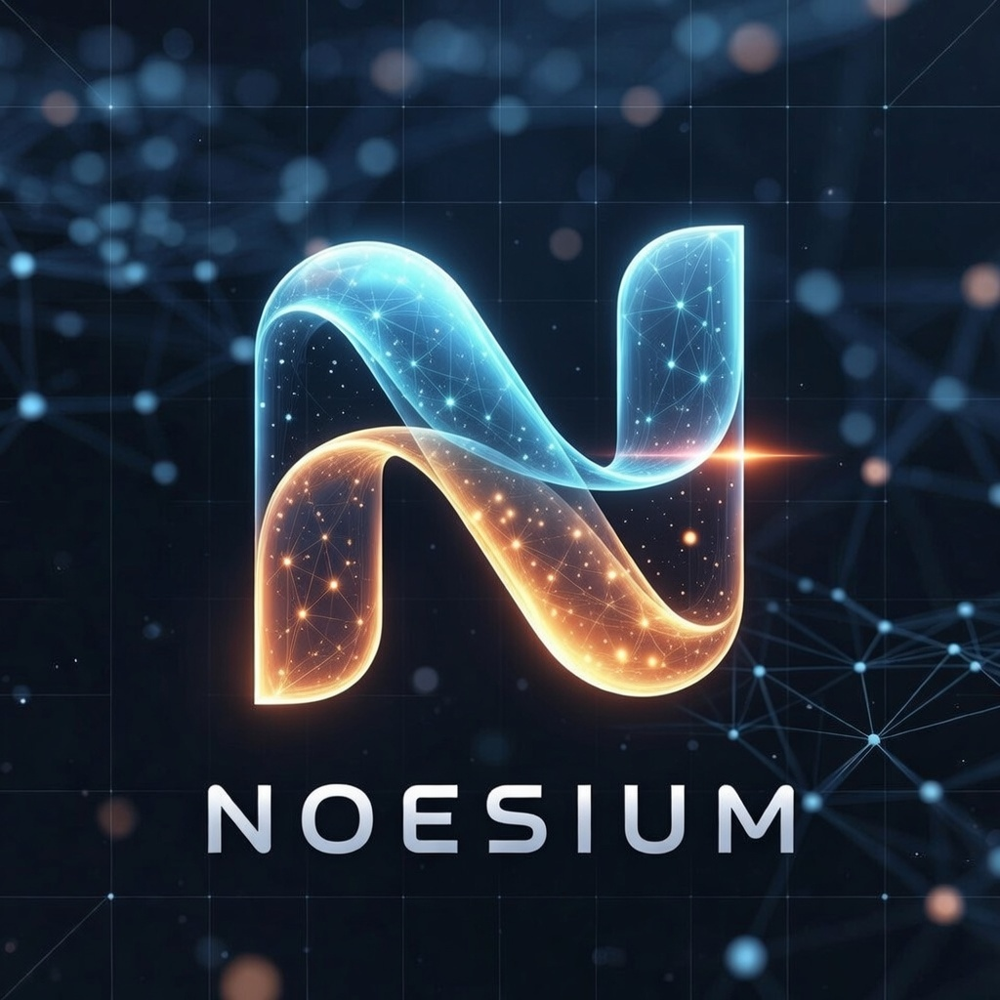

<div align="center">
  

  #

  
  
  
  

</div>

**Noesium** is a computation-driven cognitive agentic framework providing foundational abstractions for building autonomous AI agents with planning, memory, tools, and orchestration capabilities.

## Design Philosophy

Noesium is built on an **Event-Sourced Multi-Agent Kernel Architecture** that prioritizes durability, replayability, and distributed coordination. The core principles include:

### Single Execution Authority
Each agent contains exactly one execution authority: the Agent Kernel. All reasoning, planning, branching, retries, tool invocation, and delegation logic occur inside this kernel. No external orchestration layer is permitted to mutate agent state.

### Event-Sourced State
State is not stored as mutable objects. Instead, every state transition emits an event, the event log is the source of truth, and current state is a projection derived from event history. This ensures replayability, deterministic reconstruction, auditable cognition, and crash recovery.

### Delegation via Events
Delegation is modeled as event emission, not direct invocation. An agent expresses intent by publishing a task event to a capability topic. Any agent subscribed to that topic may process the task, enforcing loose coupling and capability-based coordination.

### Separation of Concerns
- **Cognition** → Agent Kernel
- **Transport** → Event Bus
- **Persistence** → Event Store
- **Memory Projection** → Projection Layer
- **Capability Routing** → Topic Subscriptions

### Architectural Goals
The system supports long-running autonomous agents, infinite reasoning loops, durable/resumable execution, distributed multi-agent collaboration, deterministic replayability, horizontal scalability, and explicit separation of cognition, transport, and persistence.

## Installation

```bash
pip install -U noesium
```

### Optional Dependencies

```bash
# Recommended: all features
pip install noesium[all]

# AI providers
pip install noesium[llm]             # OpenAI, LiteLLM, Instructor
pip install noesium[local-llm]       # Ollama, LlamaCPP
pip install noesium[ai-providers-all] # All AI providers

# Frameworks
pip install noesium[agents]          # LangChain + Bubus

# Tools & data
pip install noesium[tools]           # 17+ toolkits
pip install noesium[datascience]     # Pandas, NetworkX
pip install noesium[browser-use]     # Browser automation
```

## Quick Start

### LLM Client

```python
from noesium.core.llm import get_llm_client

# Create client (supports openai, openrouter, ollama, llamacpp)
client = get_llm_client(provider="openai", api_key="sk-...")

# Chat completion
response = client.completion([{"role": "user", "content": "Hello!"}])

# Structured output
from pydantic import BaseModel

class Answer(BaseModel):
    text: str
    confidence: float

client = get_llm_client(provider="openai", structured_output=True)
result = client.structured_completion(messages, Answer)
```

### Build an Agent

```python
from noesium.core.agent.base import BaseGraphicAgent
from noesium.core.llm import get_llm_client

class MyAgent(BaseGraphicAgent):
    def __init__(self, llm_client=None):
        super().__init__(llm_client or get_llm_client())

    def build_graph(self):
        # Define your agent's workflow graph
        pass

agent = MyAgent()
result = await agent.run("What is the meaning of life?")
```

### Use Toolkits

```python
from noesium.core.toolify import get_toolkit, ToolkitConfig

# Search toolkit
search_config = ToolkitConfig(name="search", config={"SERPER_API_KEY": "..."})
search = get_toolkit("search", search_config)
results = await search.search_google_api("Python async programming")

# Bash toolkit
bash = get_toolkit("bash")
files = await bash.list_directory(".")
```

## Core Modules

| Module | Description |
|--------|-------------|
| **Agents** (`noesium.core.agent`) | BaseAgent, BaseGraphicAgent, BaseHitlAgent, BaseResearcher |
| **LLM** (`noesium.core.llm`) | Multi-provider support, structured output, token tracking |
| **Toolify** (`noesium.core.toolify`) | Unified tool system with 17+ built-in toolkits |
| **Memory** (`noesium.core.memory`) | Multi-tier memory with semantic search |
| **Event** (`noesium.core.event`) | Domain events, message bus, tracing |
| **Vector Store** (`noesium.core.vector_store`) | PGVector, Weaviate support |

## Built-in Agents

- **Noet** - Autonomous research assistant with planning, execution, reflection cycles
- **BrowserUseAgent** - Web automation with DOM interaction and code execution
- **TacitusAgent** - Advanced research agent with iterative query generation, web search, reflection, and answer synthesis

## Built-in Toolkits

Search, Bash, Memory, Python Executor, ArXiv, Audio, Document, File Edit, GitHub, Gmail, Image, Tabular Data, Video, Wikipedia, and more.

See [AGENTS.md](AGENTS.md) for detailed documentation.

## Environment Variables

```bash
# LLM Provider
export NOESIUM_LLM_PROVIDER="openai"
export OPENAI_API_KEY="sk-..."

# Search
export SERPER_API_KEY="..."
```

## Documentation

- **[AGENTS.md](AGENTS.md)** - Detailed agent and toolkit documentation
- **`specs/`** - Design specifications (RFCs)
- **`examples/`** - Usage examples

## License

MIT License
