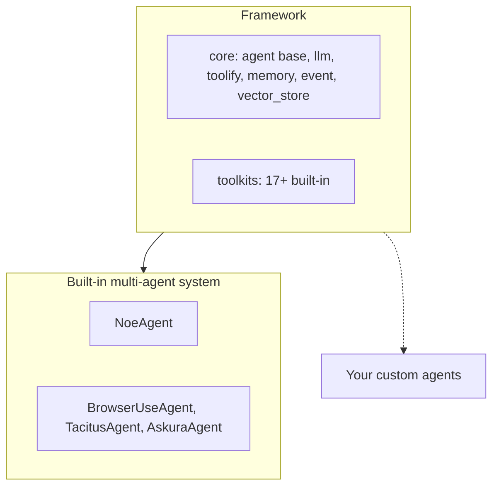

<div align="center">
  

  #

  [](https://pypi.org/project/noesium/)
  [](https://pypi.org/project/noesium/)
  [](https://github.com/mirasoth/noesium/blob/main/LICENSE)
  [](https://github.com/mirasoth/noesium)

</div>

**Noesium** is a computation-driven cognitive agentic framework. Use it as a **ready-to-run multi-agent system** (NoeAgent plus subagents) or as a **foundation** to build custom agents with core abstractions and 17+ toolkits.

## Design Philosophy

Noesium follows an **event-sourced multi-agent kernel architecture** for durability, replayability, and distributed coordination:

- **Single execution authority** — One Agent Kernel per agent; all reasoning, planning, tool use, and delegation happen inside it. No external layer mutates agent state.
- **Event-sourced state** — State is derived from an append-only event log. Enables replay, deterministic reconstruction, audit, and crash recovery.
- **Delegation via events** — Agents publish task events to capability topics; subscribers process them. Loose coupling, capability-based coordination.
- **Separation of concerns** — Cognition (Kernel), transport (Event Bus), persistence (Event Store), memory (Projection), routing (Topic subscriptions).

Goals: long-running autonomous agents, durable/resumable execution, multi-agent collaboration, horizontal scalability.

## Architecture


```mermaid
flowchart TB
  subgraph framework [Framework]
    core[core: agent base, llm, toolify, memory, event, vector_store]
    toolkits[toolkits: 17+ built-in]
  end
  subgraph builtin [Built-in multi-agent system]
    noeAgent[NoeAgent]
    subagents[BrowserUseAgent, TacitusAgent, AskuraAgent]
  end
  framework --> builtin
  framework -.-> yourAgents[Your custom agents]
```

- **Framework** — Core modules (`agent` base classes, `llm`, `toolify`, `memory`, `event`, `vector_store`) and 17+ toolkits provide the agentic building blocks.
- **Built-in multi-agent system** — NoeAgent (orchestrator) and subagents (BrowserUseAgent, TacitusAgent, AskuraAgent) are a reference implementation and directly usable. See [AGENTS.md](AGENTS.md) for details.

## Install

```bash
pip install -U noesium
```

Recommended for full features:

```bash
pip install noesium[all]
```

Optional extras:

```bash
pip install noesium[llm]             # OpenAI, LiteLLM, Instructor
pip install noesium[local-llm]       # Ollama, LlamaCPP
pip install noesium[agents]          # LangChain, LangGraph
pip install noesium[tools]           # 17+ toolkits
pip install noesium[browser-use]     # Browser automation
```

Use `uv run` for scripts when developing with the repo.

## Quick Start

### 1. Common user — NoeAgent

**Library:**

```python
import asyncio
from noesium import NoeAgent

async def main():
    agent = NoeAgent()
    result = await agent.arun("What are the latest developments in quantum computing?")
    print(result)

asyncio.run(main())
```

**TUI:**

```bash
python -m noesium.noeagent.tui
```

Full NoeAgent options, streaming, subagents, and config: [docs/noeagent_guide.md](docs/noeagent_guide.md).

### 2. Developer — Framework

Build a custom agent on the framework:

```python
from noesium.core.agent import BaseGraphicAgent
from noesium.core.llm import get_llm_client
from noesium.core.toolify import get_toolkit

class MyAgent(BaseGraphicAgent):
    def __init__(self, llm_client=None):
        super().__init__(llm_client or get_llm_client())

    def build_graph(self):
        # Define your LangGraph workflow
        pass

agent = MyAgent()
result = await agent.run("Your task")
```

For full framework usage, custom agents, and toolkits: **[docs/dev_guide.md](docs/dev_guide.md)**.

## Environment variables

```bash
export NOE_LLM_PROVIDER="openai"   # or openrouter, ollama, llamacpp
export OPENAI_API_KEY="sk-..."
export SERPER_API_KEY="..."        # for search toolkit
```

## License and support

- **License** — MIT.
- **Documentation** — [AGENTS.md](AGENTS.md), [docs/dev_guide.md](docs/dev_guide.md), [docs/specs/](docs/specs/), [examples/](examples/).
- **Issues and repo** — [GitHub](https://github.com/mirasoth/noesium).
