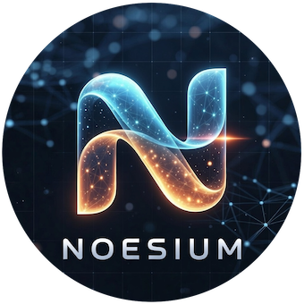

<div align="center">
  

  #

  [](https://pypi.org/project/noesium/)
  [](https://pypi.org/project/noesium/)
  [](https://github.com/mirasoth/noesium/blob/main/LICENSE)

</div>

# Noesium Framework

**A computation-driven cognitive agentic framework** for building custom autonomous systems with event-sourced architecture, reusable subagents, and 17+ toolkits.

## Overview

Noesium provides the foundational layer for building AI agents with:

- **Event-Sourced Architecture**: Durable, replayable agent execution
- **Multi-Agent Kernel**: Single execution authority for all agent operations
- **Built-in Toolkits**: 17+ production-ready tools (bash, search, Python execution, etc.)
- **Flexible LLM Support**: OpenAI, Anthropic, Google, Ollama, and more
- **Subagent Coordination**: Delegate specialized tasks to subagents
- **Memory Management**: Ephemeral and persistent memory systems

## Installation

```bash
# Basic installation
pip install noesium

# Full installation with all features
pip install noesium[all]

# Specific feature sets
pip install noesium[llm]             # OpenAI, LiteLLM, Instructor
pip install noesium[local-llm]       # Ollama, LlamaCPP
pip install noesium[agents]          # LangChain, LangGraph
pip install noesium[tools]           # 17+ toolkits
pip install noesium[browser-use]     # Browser automation
pip install noesium[postgres]        # PostgreSQL vector store
pip install noesium[weaviate]        # Weaviate vector store
```

## Quick Start

### 1. Configure Environment

```bash
export NOESIUM_LLM_PROVIDER="openai"  # Required
export OPENAI_API_KEY="sk-..."        # Required for OpenAI
```

### 2. Use the LLM Client

```python
from noesium.core.llm import get_llm_client

# Create client
client = get_llm_client()

# Basic completion
response = client.completion([
    {"role": "user", "content": "Hello, how are you?"}
])

# Structured output with Pydantic
from pydantic import BaseModel

class Answer(BaseModel):
    text: str
    confidence: float

result = client.structured_completion(
    [{"role": "user", "content": "What is 2+2?"}],
    response_model=Answer
)
```

### 3. Create a Custom Agent

```python
from noesium.core.agent import BaseGraphicAgent
from noesium.core.llm import get_llm_client
from langgraph.graph import StateGraph, END

class MyAgent(BaseGraphicAgent):
    def __init__(self, llm_client=None):
        super().__init__(llm_client or get_llm_client())

    def build_graph(self):
        workflow = StateGraph(AgentState)
        workflow.add_node("think", self.think_node)
        workflow.add_node("act", self.act_node)
        workflow.set_entry_point("think")
        workflow.add_edge("think", "act")
        workflow.add_edge("act", END)
        return workflow.compile()

    async def think_node(self, state):
        # Your thinking logic
        return state

    async def act_node(self, state):
        # Your action logic
        return state

# Use the agent
agent = MyAgent()
result = await agent.run("Complete this task")
```

### 4. Use Toolkits

```python
from noesium.core.toolify import get_toolkit

# Bash toolkit - file operations
bash = get_toolkit("bash")
files = await bash.list_directory(".")

# Search toolkit - web search
search = get_toolkit("search", config={"SERPER_API_KEY": "..."})
results = await search.search_google_api("Python async programming")

# Python executor - code execution
python_exec = get_toolkit("python_executor")
result = await python_exec.execute_code("print('Hello, World!')")
```

## Architecture

### Event-Sourced Multi-Agent Kernel

```
┌──────────────────────────────────────────┐
│            Event Bus                     │
│      (Topic-based routing)               │
└────────────┬─────────────────────────────┘
             │
    ┌────────┴────────┐
    │                 │
┌───▼────┐       ┌───▼────┐
│ Agent  │       │ Agent  │
│ Kernel │       │ Kernel │
└───┬────┘       └───┬────┘
    │                 │
┌───▼────┐       ┌───▼────┐
│ Event  │       │ Event  │
│ Store  │       │ Store  │
└────────┘       └────────┘
```

**Key Principles:**

- **Single execution authority**: All reasoning happens inside the Agent Kernel
- **Event-sourced state**: State derived from append-only event log
- **Delegation via events**: Agents coordinate through event topics
- **Durability**: Crash recovery and replay capability

### Framework Layers

```
┌──────────────────────────────────────┐
│        Subagents Layer               │  Reusable agent implementations
│  (BrowserUseAgent, Tacitus, etc.)    │
├──────────────────────────────────────┤
│        Toolkits Layer                │  17+ built-in tools
│  (bash, search, python_executor...)  │
├──────────────────────────────────────┤
│          Core Layer                  │  Framework primitives
│  (agents, tools, events, memory,     │
│   LLM, config, kernel)               │
└──────────────────────────────────────┘
```

## Built-in Toolkits

| Toolkit | Name | Description | Key Features |
|---------|------|-------------|--------------|
| Bash | `bash` | File operations & shell | List, read, write, execute |
| Python Executor | `python_executor` | Execute Python code | Sandbox, timeout, output capture |
| Search | `search` | Web search | Google, Tavily, DuckDuckGo |
| ArXiv | `arxiv` | Academic papers | Search, download, parse |
| Memory | `memory` | Persistent memory | Read, write, list, delete |
| Document | `document` | Document processing | PDF, Word, Excel |
| Image | `image` | Image processing | Resize, convert, analyze |
| Audio | `audio` | Audio processing | Transcription, synthesis |
| Wikipedia | `wikipedia` | Wikipedia search | Search, retrieve articles |
| GitHub | `github` | GitHub operations | Repos, issues, PRs |

## Agent Types

| Type | Description | Use Case |
|------|-------------|----------|
| `BaseAgent` | Abstract base with LLM and token tracking | Foundation for all agents |
| `BaseGraphicAgent` | LangGraph-based with state management | Complex multi-step workflows |
| `AskuraAgent` | Conversation agent with sessions | Interactive chat applications |
| `TacitusAgent` | Research agent with source management | Information gathering & synthesis |
| `BaseSubagentRuntime` | Reusable subagent components | Modular capability providers |

## LLM Providers

Support for multiple LLM providers:

- **OpenAI**: GPT-4, GPT-3.5, GPT-4 Vision
- **Anthropic**: Claude 3.5 Sonnet, Claude 3 Opus
- **Google**: Gemini Pro, Gemini Pro Vision
- **OpenRouter**: Unified API for multiple providers
- **LiteLLM**: 100+ LLM APIs
- **Ollama**: Local models (Llama 3, Mistral, etc.)
- **LlamaCPP**: Local GGUF models

## Memory System

Multi-tier memory architecture:

- **Working Memory**: In-memory, session-based
- **Durable Memory**: Persistent, database-backed
- **Semantic Memory**: Vector embeddings for retrieval

```python
from noesium.core.memory import MemoryManager

# Create memory manager
memory = MemoryManager(config={"provider": "ephemeral"})

# Write memory
await memory.write_memory(
    slot="research_notes",
    content="Key findings...",
    metadata={"topic": "AI"}
)

# Read memory
content = await memory.read_memory("research_notes")
```

## Event System

Topic-based event coordination:

```python
from noesium.core.event import EventBus, Event

# Create event bus
bus = EventBus()

# Subscribe to events
async def handle_task(event: Event):
    print(f"Received: {event.data}")

bus.subscribe("analysis", handle_task)

# Publish events
event = Event(
    type="TaskRequested",
    topic="analysis",
    data={"task": "Analyze data"}
)
await bus.publish(event)
```

## Configuration

### Environment Variables

```bash
# LLM Configuration
export NOESIUM_LLM_PROVIDER="openai"
export OPENAI_API_KEY="sk-..."
export ANTHROPIC_API_KEY="sk-ant-..."

# Toolkit Configuration
export SERPER_API_KEY="..."      # Web search
export JINA_API_KEY="..."        # Search embeddings
```

### Configuration File

Create `noesium.toml`:

```toml
[llm]
provider = "openai"
model = "gpt-4o"
temperature = 0.7

[agent]
max_iterations = 25
max_tool_calls_per_step = 5

[tools]
enabled_toolkits = ["bash", "search", "python_executor"]

[memory]
provider = "ephemeral"

[tools.toolkit_configs.bash]
timeout = 600
shell = "/bin/zsh"
```

## Development

### Setup

```bash
# Clone the workspace
git clone https://github.com/mirasoth/noesium.git
cd noesium

# Install with dev dependencies
make setup
```

### Testing

```bash
# Run tests
make test-noesium

# Run with coverage
make test-coverage
```

### Code Quality

```bash
make quality    # Run all quality checks
make format     # Format code
make lint       # Run linters
```

## Documentation

- **[Quick Guide](../docs/user_guides/quick_guide_noesium.md)** - Get started quickly
- **[Developer Guide](../docs/user_guides/dev_guide.md)** - Framework development
- **[Specifications](../docs/specs/)** - Technical RFCs
- **[Examples](../examples/)** - Usage examples

## Requirements

- Python >= 3.11
- For specific features, see optional dependencies above

## Applications Built on Noesium

- **[NoeAgent](../noeagent/)** - Multi-agent system implementation
- **[Voyager](../voyager/)** - 24/7 digital companion

## License

MIT License - see [LICENSE](../LICENSE) for details.

## Contributing

See [CONTRIBUTING.md](../CONTRIBUTING.md) for guidelines.

## Support

- **Issues**: [GitHub Issues](https://github.com/mirasoth/noesium/issues)
- **PyPI**: [noesium](https://pypi.org/project/noesium/)