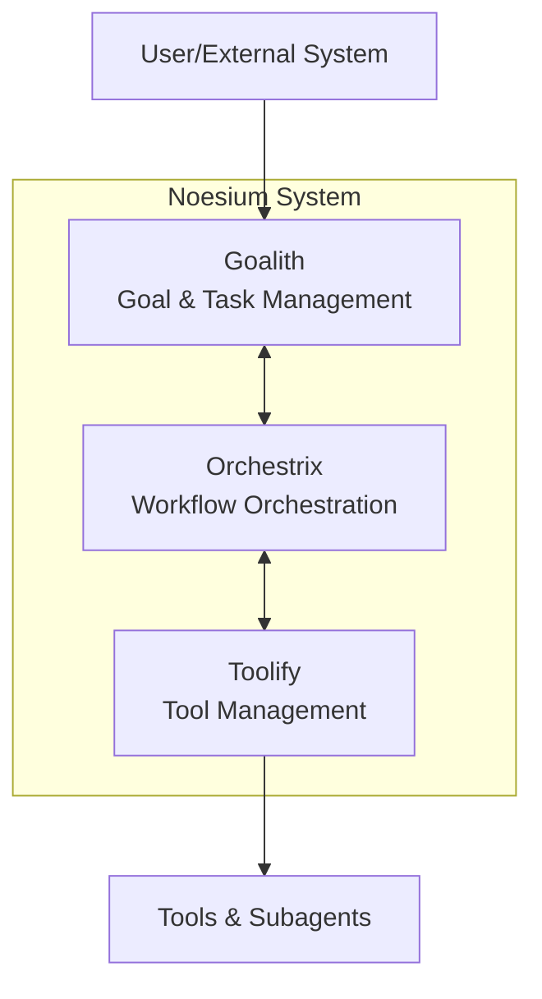
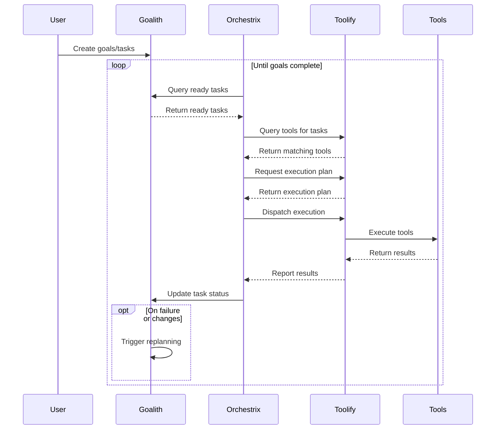

# RFC-0001: Noesium System Overview

**Status**: Draft
**Authors**: Noesium Team
**Created**: 2026-01-26
**Last Updated**: 2026-01-26
**Depends on**: —
**Supersedes**: —
**Stage**: Core Engine

---

## 1. Abstract

This RFC defines the high-level architecture of the Noesium multi-agent system. Noesium consists of three core subsystems: **Goalith** for DAG-based goal and task management, **Toolify** for tool registration and execution, and **Orchestrix** for workflow orchestration and coordination. Together, these components enable hierarchical goal decomposition, tool-agnostic execution, and adaptive replanning in multi-agent and human-AI collaborative workflows.

---

## 2. Scope and Non-Goals

### 2.1 Scope

This RFC defines:

* The three core subsystems and their boundaries
* The interaction flow between subsystems
* Design principles guiding the overall architecture
* Standardized status values and data models

### 2.2 Non-Goals

This RFC does **not** define:

* Detailed internal implementation of each subsystem (see RFC-0002, RFC-0003, RFC-0004)
* Specific tool implementations or agent behaviors
* Deployment configurations or infrastructure requirements
* External API authentication and authorization mechanisms

---

## 3. Background & Motivation

Modern AI applications require coordination between multiple agents, tools, and human participants. Building such systems requires:

1. **Goal Management**: Hierarchical decomposition of complex goals into executable tasks
2. **Tool Abstraction**: Unified interface for heterogeneous tools (LLMs, APIs, scripts, MCP servers)
3. **Workflow Orchestration**: Coordination layer that bridges goals to tool execution

Noesium addresses these needs through a modular architecture that separates concerns while enabling seamless integration. Each subsystem can be developed, tested, and replaced independently.

---

## 4. Design Principles

1. **Modularity**: Each component is independently extensible and replaceable. Subsystems communicate through well-defined interfaces.

2. **Event-Driven Architecture**: Asynchronous messaging and notifications enable decoupling and scalability. Components react to events rather than polling.

3. **Dynamic Dependency Management**: Both goals and tools support runtime updates to dependencies, enabling adaptive workflows.

4. **Robust Feedback Loop**: Continuous execution monitoring feeds back to goal/task management for replanning.

5. **Security by Design**: Access control for APIs and communication channels is a first-class concern.

---

## 5. System Architecture

### 5.1 Component Overview



### 5.2 Component Responsibilities

| Component | Role & Responsibility |
|-----------|----------------------|
| **Goalith** | Manages hierarchical goals, subgoals, and tasks as a DAG. Handles decomposition, prioritization, updates, and conflict resolution. Exposes APIs for goal/task management. Determines task readiness and priority within the DAG. |
| **Toolify** | Central registry for tools. Manages tool metadata, dependencies, and execution planning. Provides adapters for different tool types (LangChain, MCP, REST, scripts). Treats subagents as a tool type. |
| **Orchestrix** | Coordinates workflows by bridging Goalith and Toolify. Fetches executable tasks, requests tool plans, dispatches execution, handles feedback, and triggers replanning. Owns the Communication Hub for inter-component messaging. Manages execution scheduling (queue management, dispatch timing). |

### 5.3 Goalith — DAG-Based Goal & Task Management

**Purpose**: Manage goal/task hierarchy and lifecycle.

**Key Modules**:
- **GraphStore**: DAG data structure and operations
- **GoalNode**: Node metadata (description, status, dependencies, priority)
- **DecomposerRegistry**: Pluggable goal decomposers
- **Scheduler**: Prioritization and task readiness determination
- **UpdateProcessor**: Processes updates with conflict detection
- **ConflictManager**: Detects and resolves DAG conflicts
- **Replanner**: Dynamic plan adjustments
- **MemoryManager**: Context enrichment
- **Notifier**: Event notification system

### 5.4 Toolify — Tool Management

**Purpose**: Manage functional tools, generate execution plans, and provide tool execution infrastructure.

**Key Modules**:
- **Tool Registry**: Register/unregister tools with metadata
- **Metadata Store**: Persistent searchable tool data
- **Dependency Graph**: Tool dependencies (static + dynamic)
- **Execution Planner**: Creates optimized tool execution sequences
- **Execution Interface**: Adapters for different tool types
- **Monitoring & Logging**: Tracks execution and reports

**Note**: Subagents are treated as a tool type through the subagent adapter pattern.

### 5.5 Orchestrix — Workflow Orchestration & Coordination

**Purpose**: Bridge Goalith and Toolify to execute workflows end-to-end.

**Key Responsibilities**:
- Fetch ready tasks from Goalith
- Query Toolify for capable tools
- Request execution plans from Toolify
- Dispatch execution commands
- Aggregate execution feedback
- Trigger replanning when needed
- Subscribe to event notifications
- Own the Communication Hub for inter-component messaging
- Manage execution scheduling (queue management, dispatch timing)

---

## 6. Interaction Flow



**Step-by-step**:

1. User or system creates goals/tasks in Goalith
2. Orchestrix queries Goalith for ready tasks
3. Orchestrix queries Toolify for tools matching tasks
4. Toolify generates execution plans for those tasks
5. Orchestrix dispatches execution via Toolify to subagents/tools
6. Toolify monitors execution, reports back to Orchestrix
7. Orchestrix updates Goalith on task status
8. Goalith triggers replanning if necessary
9. Loop continues until goals complete

---

## 7. Standardized Status Values

All components MUST use these standardized status values for tasks and goals:

| Status | Description |
|--------|-------------|
| `pending` | Not yet ready for execution; waiting on dependencies |
| `ready` | All dependencies satisfied; ready for execution |
| `in_progress` | Currently being executed |
| `completed` | Successfully finished |
| `failed` | Execution failed |
| `cancelled` | Cancelled by user or system |

---

## 8. Data Model Examples

### 8.1 Goalith GoalNode

```json
{
  "id": "goal_001",
  "description": "Complete research paper",
  "status": "pending",
  "dependencies": ["goal_000"],
  "priority": 10,
  "context": { "deadline": "2025-09-01" }
}
```

### 8.2 Toolify Tool Metadata

```json
{
  "tool_id": "nlp_summarizer_v1",
  "name": "NLP Summarizer",
  "capabilities": ["text_summarization"],
  "input_schema": { "text": "string" },
  "output_schema": { "summary": "string" },
  "version": "1.0"
}
```

### 8.3 Orchestrix Task Execution Request

```json
{
  "task_id": "task_123",
  "tool_id": "nlp_summarizer_v1",
  "input": {
    "text": "Long research paper content..."
  },
  "execution_parameters": {
    "timeout": 120
  }
}
```

---

## 9. Relationship to Other RFCs

* **RFC-0002 (Goalith)**: Detailed specification of the goal and task management subsystem
* **RFC-0003 (Toolify)**: Detailed specification of the tool management subsystem
* **RFC-0004 (Orchestrix)**: Detailed specification of the workflow orchestration subsystem

---

## 10. Open Questions

* What authentication mechanisms should be used for inter-component communication?
* Should there be a unified schema registry for input/output validation across components?
* How should component health checks and circuit breakers be implemented?

---

## 11. Conclusion

Noesium provides a modular, event-driven architecture for multi-agent systems. By separating goal management (Goalith), tool execution (Toolify), and workflow orchestration (Orchestrix), the system achieves flexibility and extensibility while maintaining clear boundaries between concerns.

> **Noesium: A modular foundation for intelligent multi-agent workflows**
