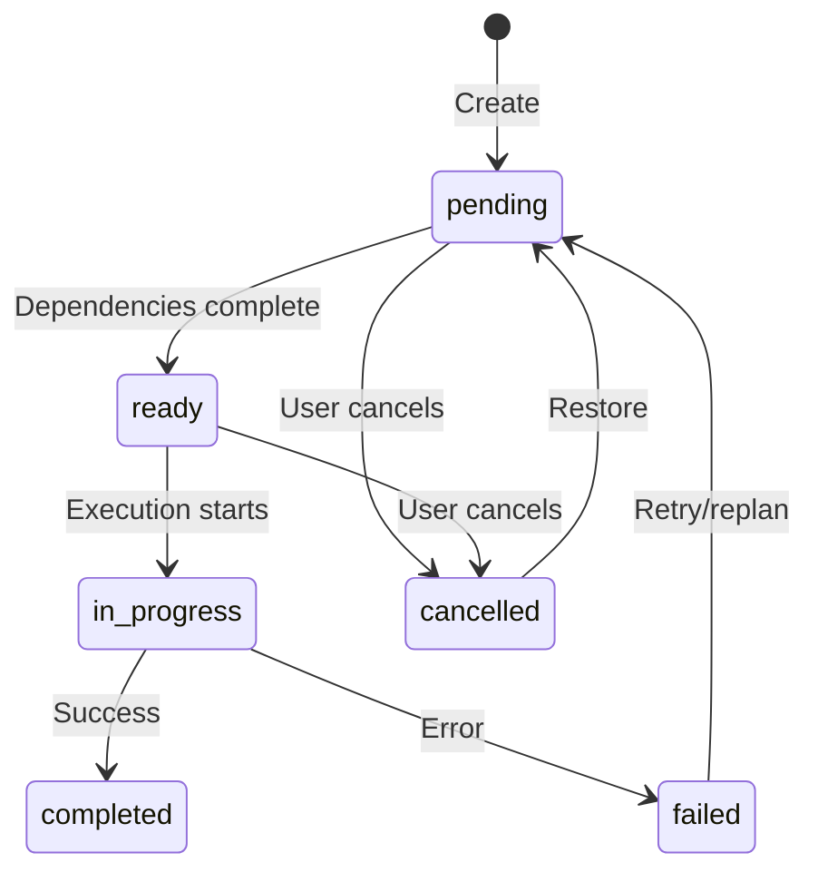

# RFC-0002: Goalith — DAG-Based Goal & Task Management

**Status**: Draft
**Authors**: Noesium Team
**Created**: 2026-01-26
**Last Updated**: 2026-01-26
**Depends on**: [RFC-0001](rfc-0001.md)
**Supersedes**: —
**Stage**: Core Engine

---

## 1. Abstract

Goalith is a DAG-based goal and task management system focused on hierarchical goal modeling, flexible decomposition, reactive updates, and extensibility. It manages goals, subgoals, and tasks with explicit dependency and status tracking. Goalith determines task priority and readiness within the DAG but does not handle execution or agent interaction directly—those responsibilities belong to Orchestrix and Toolify.

---

## 2. Scope and Non-Goals

### 2.1 Scope

This RFC defines:

* DAG-based goal and task representation
* Goal decomposition interfaces and patterns
* Prioritization and readiness determination
* Reactive update and notification mechanisms
* Conflict detection and resolution interfaces
* Adaptive replanning triggers and hooks
* Memory integration for context enrichment

### 2.2 Non-Goals

This RFC does **not** define:

* Task execution (see [RFC-0003](rfc-0003.md) and [RFC-0004](rfc-0004.md))
* Agent interaction protocols
* Retry/fallback policies (handled by Orchestrix)
* Execution scheduling and queue management (handled by Orchestrix)
* Tool selection or capability matching (handled by Toolify)

---

## 3. Background & Motivation

Complex workflows require breaking down high-level goals into manageable tasks with clear dependencies. Traditional task lists lack the structure to express:

1. **Hierarchical relationships**: Goals contain subgoals which contain tasks
2. **Dependency ordering**: Task B cannot start until Task A completes
3. **Dynamic replanning**: Plans must adapt when tasks fail or priorities change
4. **Multi-source updates**: Humans, AI agents, and external systems all contribute updates

Goalith addresses these needs with a DAG-based model that cleanly separates planning from execution.

---

## 4. Design Principles

1. **Separation of Concerns**: Goalith focuses purely on goal/task modeling, decomposition, tracking, and updates. Execution is delegated to higher-level systems.

2. **Pluggable Decomposition**: Any entity (human, LLM, symbolic planner) can decompose goals through a standard interface.

3. **Event-Driven Updates**: Asynchronous notifications enable real-time monitoring and collaboration.

4. **Conflict Awareness**: Built-in interfaces for detecting and resolving conflicts from concurrent updates.

5. **Extensible Storage**: The graph store abstraction allows swapping implementations without affecting the rest of the system.

---

## 5. Core Functionalities

### 5.1 DAG-Based Goal Modeling

Goals, subgoals, and tasks are represented as nodes in a Directed Acyclic Graph (DAG).

**Node Properties**:
- `id`: Unique identifier
- `description`: Human-readable description
- `status`: Current state (see [Section 6](#6-status-values))
- `type`: `goal`, `subgoal`, or `task`
- `dependencies`: List of node IDs that must complete first
- `children`: List of child node IDs
- `priority`: Numeric priority value
- `context`: Arbitrary metadata dictionary
- `created_at`: Creation timestamp
- `updated_at`: Last modification timestamp

**DAG Invariants**:
- MUST be acyclic (no circular dependencies)
- MUST have at least one root node (no dependencies) per workflow
- Parent-child relationships MUST be consistent with dependencies

### 5.2 Goal Decomposition Interface

Goalith supports pluggable **GoalDecomposer** components to break down goals into subgoals or tasks.

**Decomposer Types**:
- **Human decomposers**: Manual breakdown by users
- **LLM decomposers**: AI-powered goal analysis
- **Symbolic planners**: Rule-based decomposition
- **Hybrid decomposers**: Combination of approaches

**Interface Contract**:
```python
class GoalDecomposer(Protocol):
    def decompose(self, goal_node: GoalNode) -> list[GoalNode]:
        """Break down a goal into subgoals or tasks."""
        ...
```

### 5.3 Reactive Update Mechanism

Goalith supports asynchronous, event-driven updates for:
- Goal/task status changes
- Context modifications
- Structure changes (add/remove nodes, modify edges)
- Priority adjustments

**Update Sources**:
- Human users via UI or API
- AI agents during execution
- External systems via webhooks
- Orchestrix feedback loop

### 5.4 Prioritization & Readiness

Goalith determines which tasks are ready for execution and their relative priority.

**Readiness Criteria**:
- All dependencies have status `completed`
- Node is not `cancelled` or `failed`
- No blocking conflicts exist

**Priority Policies**:
- Numeric priority comparison
- Deadline-based urgency
- Custom policy implementations

**Note**: Goalith determines **readiness and priority**. Orchestrix handles **execution scheduling** (when and how to dispatch ready tasks).

### 5.5 Conflict Detection & Resolution

Goalith provides interfaces for detecting and resolving conflicts from concurrent updates.

**Conflict Types**:
- Cycle introduction
- Invalid status transitions
- Duplicate priority assignments
- Semantic conflicts (contradictory goals)

**Resolution Strategies**:
- LLM-based reasoning
- Human adjudication
- Rule-based automatic resolution

### 5.6 Adaptive Replanning

Goalith enables dynamic replanning triggered by:
- Task failures
- New goal additions
- Priority changes
- Deadline misses
- External signals

**Replanning Hooks**:
- Re-decomposition of affected subgraphs
- Priority recalculation
- Dependency restructuring

### 5.7 Contextual Memory Integration

Goalith defines a memory interface to enrich goal context with external knowledge.

**Memory Operations**:
- Retrieve stored context on node creation or lookup
- Persist annotations, execution notes, performance metrics
- Support for vector databases, SQL, or in-memory caches

---

## 6. Status Values

Goalith uses standardized status values as defined in [RFC-0001](rfc-0001.md):

| Status | Description |
|--------|-------------|
| `pending` | Not yet ready for execution; waiting on dependencies |
| `ready` | All dependencies satisfied; ready for execution |
| `in_progress` | Currently being executed |
| `completed` | Successfully finished |
| `failed` | Execution failed |
| `cancelled` | Cancelled by user or system |

**Valid State Transitions**:



---

## 7. Component Architecture

### 7.1 Core Graph Module

**Purpose**: Underlying DAG storage and basic graph operations

**GraphStore**:
- Wraps a graph library (e.g., networkx.DiGraph)
- CRUD operations on nodes and edges
- Query "ready" nodes (all dependencies done)
- Persist/load graph snapshots

**GoalNode**:
- Data model for nodes (metadata only)
- Lightweight DTO that GraphStore knows how to serialize

### 7.2 Decomposition Module

**Purpose**: Expand goals into subgoals/tasks

**DecomposerRegistry**:
- Register/unregister GoalDecomposer implementations by name
- Lookup and invoke the right decomposer for a node

**GoalDecomposer (interface)**:
- Abstract contract: `decompose(goalNode) → [GoalNode,…]`
- Plug in humans, LLM agents, symbolic planners, callables

### 7.3 Scheduling & Prioritization Module

**Purpose**: Determine which ready node to surface next

**PriorityPolicy**:
- Encapsulates numeric or categorical priority rules
- Compare two ready nodes and pick one

**Scheduler**:
- Given a list of ready nodes, applies PriorityPolicy
- Exposes methods like `get_next()` and `peek_all()`

### 7.4 Update & Notification Module

**Purpose**: Handle external updates and broadcast changes

**UpdateQueue**:
- Thread- or async-safe queue of update events
- Standard event schema (status change, edit, add/remove)

**UpdateProcessor**:
- Consumes events, applies them to GraphStore
- Hooks into Conflict Module before final commit

**Notifier**:
- Observer pattern for subscribers
- Emits events when nodes change (status, priority, structure)

### 7.5 Conflict Management Module

**Purpose**: Detect and resolve concurrent or semantic conflicts

**ConflictDetector**:
- Watches for illegal states (cycles, invalid transitions)
- Emits conflict reports

**ConflictResolver (interface)**:
- Abstract contract: `resolve(conflict) → resolutionAction`
- Plug in LLM-based reasoning, human adjudication, or rules

**ConflictOrchestrator**:
- Coordinates detection → resolution → application

### 7.6 Replanning Module

**Purpose**: Reactively adjust plans when things go awry

**ReplanTrigger**:
- Defines conditions (failure, deadline miss, external signal)
- Emits "replan needed" events

**Replanner**:
- Hooks into Decomposition and Scheduling modules
- Can re-decompose affected subgraphs or adjust priorities

### 7.7 Memory Integration Module

**Purpose**: Enrich goals with external context/history

**MemoryInterface (abstract)**:
- Contract for read/write of contextual data
- Could be vector DB, SQL, in-memory cache, etc.

**MemoryManager**:
- Retrieves stored context on node creation or lookup
- Persists annotations, execution notes, performance metrics

### 7.8 API & Integration Layer

**Purpose**: Expose Goalith functionality to UIs or Orchestrix

**Goalith (Façade)**:
- Aggregates all sub-modules
- High-level methods: `createGoal`, `decomposeGoal`, `nextTask`, `postUpdate`, `subscribe`, `triggerReplan`

**Adapters**:
- LangGraph adapter: wrap Goalith calls as graph nodes
- HTTP/CLI adapter: expose REST endpoints or CLI commands

---

## 8. Examples

### 8.1 Creating a Goal Hierarchy

```json
{
  "id": "goal_001",
  "description": "Complete research paper",
  "status": "pending",
  "type": "goal",
  "dependencies": [],
  "children": ["subgoal_001", "subgoal_002"],
  "priority": 10,
  "context": { "deadline": "2025-09-01" }
}
```

```json
{
  "id": "subgoal_001",
  "description": "Literature review",
  "status": "pending",
  "type": "subgoal",
  "dependencies": [],
  "children": ["task_001", "task_002"],
  "priority": 8,
  "context": {}
}
```

```json
{
  "id": "task_001",
  "description": "Search for relevant papers",
  "status": "ready",
  "type": "task",
  "dependencies": [],
  "children": [],
  "priority": 7,
  "context": { "query": "multi-agent systems" }
}
```

### 8.2 Decomposition Example

```python
# Register a decomposer
goalith.register_decomposer("llm", LLMDecomposer(model="gpt-4"))

# Decompose a goal
subgoals = goalith.decompose_goal("goal_001", decomposer="llm")
# Returns list of newly created child nodes
```

### 8.3 Querying Ready Tasks

```python
# Get the next ready task
next_task = goalith.get_next_task()

# Get all ready tasks
ready_tasks = goalith.get_ready_tasks()
```

### 8.4 Status Update

```json
{
  "event_type": "status_change",
  "node_id": "task_001",
  "old_status": "in_progress",
  "new_status": "completed",
  "timestamp": "2025-09-01T10:30:00Z",
  "source": "orchestrix"
}
```

---

## 9. Relationship to Other RFCs

* **[RFC-0001](rfc-0001.md)**: Defines overall system architecture and standardized status values
* **[RFC-0003](rfc-0003.md)**: Toolify manages tool execution; Goalith provides ready tasks
* **[RFC-0004](rfc-0004.md)**: Orchestrix consumes ready tasks from Goalith and reports execution results back

---

## 10. Open Questions

* Should goal versions be tracked for auditing purposes?
* How should large DAGs be partitioned for performance?
* What limits should be placed on decomposition depth?

---

## 11. Conclusion

Goalith provides a robust, flexible foundation for goal and task management in multi-agent workflows. By representing goals as a DAG with explicit dependencies and supporting pluggable decomposition, Goalith enables complex hierarchical planning while maintaining clean separation from execution concerns.

> **Goalith: DAG-based goal management for adaptive multi-agent workflows**
