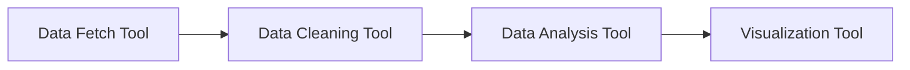
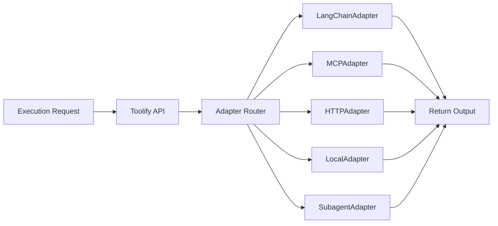

# RFC-0003: Toolify — Tool Management System

**Status**: Draft
**Authors**: Noesium Team
**Created**: 2026-01-26
**Last Updated**: 2026-01-26
**Depends on**: [RFC-0001](rfc-0001.md)
**Supersedes**: —
**Stage**: Core Engine

---

## 1. Abstract

Toolify is the centralized tool management system for the Noesium multi-agent ecosystem. It provides tool registration, metadata management, execution planning, and a unified execution interface for heterogeneous tool types. Toolify is tool-agnostic—it manages tool metadata, connectivity, and execution rules without performing high-level reasoning. Subagents are treated as a special tool type through the adapter pattern.

---

## 2. Scope and Non-Goals

### 2.1 Scope

This RFC defines:

* Tool registration (static and dynamic)
* Tool metadata schema and storage
* Dependency graph management for tool execution
* Execution planning (tool sequence generation)
* Execution interface and adapter pattern
* Monitoring and logging infrastructure

### 2.2 Non-Goals

This RFC does **not** define:

* Workflow orchestration (see [RFC-0004](rfc-0004.md))
* Inter-component communication hub (owned by Orchestrix)
* Goal/task management (see [RFC-0002](rfc-0002.md))
* High-level reasoning or decision-making
* Specific tool implementations

---

## 3. Background & Motivation

Modern AI applications integrate diverse tools:
- LangChain tools for LLM-powered operations
- MCP (Model Context Protocol) tools for standardized integrations
- REST APIs for external services
- Local scripts for custom operations
- Subagents for complex autonomous tasks

Without a unified management layer, each tool type requires custom integration code, leading to:
- Duplicated adapter logic
- Inconsistent error handling
- Difficult capability discovery
- Complex dependency management

Toolify addresses these issues with a centralized registry and unified execution interface.

---

## 4. Design Principles

1. **Tool Agnosticism**: Toolify manages any tool type through adapters without embedding tool-specific logic in the core.

2. **Unified Interface**: All tools, regardless of underlying implementation, are invoked through the same execution interface.

3. **Subagents as Tools**: Subagents are a special tool type, not a separate management concern. The SubagentAdapter enables treating agents as tools.

4. **Separation of Planning and Orchestration**: Toolify's Execution Planner creates tool sequences for tasks; Orchestrix handles workflow-level orchestration.

5. **Observable by Default**: All tool executions are logged and monitored for debugging and optimization.

---

## 5. Component Architecture

### 5.1 Registry Layer

**Purpose**: Manage metadata and configurations for each tool.

**Responsibilities**:
- Maintain tool registry (unique ID, name, type, capabilities, version)
- Support static registration (via config files or bootstrapping)
- Support dynamic registration (via API calls during runtime)
- Store tool capabilities in structured form (input schema, output schema, supported tasks)

**Tool Metadata Schema**:

```json
{
  "tool_id": "search_web_v1",
  "name": "Web Search",
  "type": "LangChainTool",
  "capabilities": ["search", "fetch_content"],
  "input_schema": { "query": "string" },
  "output_schema": { "results": "list" },
  "dependencies": ["http_client_v1"],
  "status": "active",
  "version": "1.0",
  "timeout_ms": 30000,
  "retry_policy": {
    "max_retries": 3,
    "backoff_ms": 1000
  }
}
```

### 5.2 Dependency Graph Manager

**Purpose**: Manage the execution DAG for tools.

**Features**:
- **Static configuration**: Predefined dependency graphs stored in config files
- **Dynamic configuration**: Modify or create DAG nodes/edges at runtime via API
- **Dependency resolution**: Ensure prerequisites run before dependent tools
- **Graph versioning**: Track historical DAG changes for reproducibility
- **Graph querying API**: Allow Orchestrix to request partial or full execution graphs

**Example Dependency DAG**:



### 5.3 Execution Planner

**Purpose**: Map incoming tasks to the correct tools and create execution sequences.

**Note**: This component was previously called "Orchestration Engine" in early designs. It has been renamed to "Execution Planner" to clarify that it plans tool sequences but does not orchestrate workflows—that responsibility belongs to Orchestrix.

**Workflow**:
1. Receive execution request from Orchestrix
2. Look up required tools and dependencies in the Registry
3. Build execution plan using the Dependency Graph
4. Return plan to Orchestrix for dispatch

**Selection Modes**:
- **Direct Mapping**: Known tool for known task
- **Capability Matching**: Match required task capability to available tools
- **Fallback Chain**: Try primary → secondary → backup tools

**Execution Plan Schema**:

```json
{
  "task_id": "task_123",
  "plan_id": "plan_456",
  "steps": [
    {
      "step_id": 1,
      "tool_id": "web_fetcher_v1",
      "input_mapping": { "url": "$.params.url" }
    },
    {
      "step_id": 2,
      "tool_id": "text_cleaner_v2",
      "input_mapping": { "text": "$.steps[0].output.content" },
      "depends_on": [1]
    },
    {
      "step_id": 3,
      "tool_id": "summarizer_llm_v3",
      "input_mapping": { "text": "$.steps[1].output.cleaned_text" },
      "depends_on": [2]
    }
  ]
}
```

### 5.4 Execution Interface

**Purpose**: Provide a unified method for running tools regardless of implementation type.

**Supported Tool Types**:

| Type | Adapter | Description |
|------|---------|-------------|
| LangChain Tool | `LangChainAdapter` | Invoked via LangChain's Tool interface |
| MCP Tool | `MCPAdapter` | Invoked via Model Context Protocol |
| REST API | `HTTPAdapter` | Invoked via HTTP requests |
| Local Script | `LocalAdapter` | Invoked via subprocess execution |
| Subagent | `SubagentAdapter` | Invoked as an autonomous agent |

**Execution Flow**:



### 5.5 Adapter Pattern

Each tool type has a corresponding adapter implementing a common interface:

```python
class ToolAdapter(Protocol):
    async def execute(
        self,
        tool_id: str,
        input_data: dict,
        config: dict
    ) -> ToolResult:
        """Execute a tool and return results."""
        ...
    
    async def validate_input(
        self,
        tool_id: str,
        input_data: dict
    ) -> ValidationResult:
        """Validate input against tool schema."""
        ...
    
    async def health_check(self, tool_id: str) -> HealthStatus:
        """Check if tool is available and healthy."""
        ...
```

**SubagentAdapter**:

Subagents are treated as tools through the `SubagentAdapter`. This adapter:
- Wraps agent invocation in the standard tool interface
- Manages agent lifecycle (initialization, execution, cleanup)
- Handles agent-specific concerns (context passing, memory)
- Reports agent execution as tool results

```json
{
  "tool_id": "research_agent_v1",
  "name": "Research Agent",
  "type": "Subagent",
  "capabilities": ["deep_research", "citation_generation"],
  "input_schema": { "query": "string", "depth": "integer" },
  "output_schema": { "report": "string", "citations": "list" },
  "agent_config": {
    "model": "gpt-4",
    "max_iterations": 10,
    "tools": ["web_search", "document_reader"]
  }
}
```

### 5.6 API Layer

**Purpose**: Expose HTTP/WebSocket interface for internal and external services.

**Endpoints**:

| Method | Endpoint | Description |
|--------|----------|-------------|
| `POST` | `/tools/register` | Register new tool |
| `DELETE` | `/tools/{tool_id}` | Unregister tool |
| `GET` | `/tools` | List available tools |
| `GET` | `/tools/{tool_id}` | Get tool details |
| `POST` | `/tools/search` | Search tools by capability |
| `POST` | `/execute` | Execute a tool by ID or capability |
| `POST` | `/plan` | Generate execution plan for a task |
| `GET` | `/graph` | Retrieve dependency graph |
| `POST` | `/graph/update` | Modify dependency graph |

### 5.7 Monitoring & Logging

**Purpose**: Ensure observability and reliability.

**Metrics**:
- Tool invocation count
- Execution latency per tool
- Failure rate and error types
- Resource utilization

**Logging**:
- Structured logs (JSON format)
- Persistent history of all executions
- Audit trail for security compliance

**Integration Points**:
- OpenTelemetry for distributed tracing
- Prometheus for metrics collection
- Structured logging to stdout/file

---

## 6. Examples

### 6.1 Tool Registration

**Static Registration** (config file):

```yaml
tools:
  - tool_id: web_search_v1
    name: Web Search
    type: LangChainTool
    capabilities: [search]
    input_schema:
      query: string
    output_schema:
      results: list
```

**Dynamic Registration** (API):

```bash
POST /tools/register
Content-Type: application/json

{
  "tool_id": "custom_analyzer_v1",
  "name": "Custom Analyzer",
  "type": "LocalScript",
  "capabilities": ["analyze", "report"],
  "input_schema": { "data": "object" },
  "output_schema": { "analysis": "object" },
  "script_path": "/opt/tools/analyzer.py"
}
```

### 6.2 Execution Plan Generation

**Request**:

```json
{
  "task_id": "task_123",
  "goal": "summarize_webpage",
  "params": { "url": "https://example.com" }
}
```

**Response**:

```json
{
  "task_id": "task_123",
  "plan_id": "plan_789",
  "steps": [
    { "step_id": 1, "tool_id": "web_fetcher_v1" },
    { "step_id": 2, "tool_id": "text_cleaner_v2", "depends_on": [1] },
    { "step_id": 3, "tool_id": "summarizer_llm_v3", "depends_on": [2] }
  ]
}
```

### 6.3 Tool Execution

**Request**:

```json
{
  "tool_id": "summarizer_llm_v3",
  "input": { "text": "Long article content..." },
  "execution_config": { "timeout_ms": 60000 }
}
```

**Response**:

```json
{
  "tool_id": "summarizer_llm_v3",
  "status": "completed",
  "output": { "summary": "The article discusses..." },
  "execution_time_ms": 2500,
  "metadata": {
    "model_used": "gpt-4",
    "tokens_consumed": 1500
  }
}
```

---

## 7. Technology Choices

| Component | Suggested Technology |
|-----------|---------------------|
| Registry & Metadata | PostgreSQL / SQLite |
| API Layer | FastAPI / Flask |
| Dependency Graph | NetworkX / custom DAG manager |
| Execution Interface | Python adapters + asyncio |
| Logging & Monitoring | OpenTelemetry + Prometheus |

---

## 8. Relationship to Other RFCs

* **[RFC-0001](rfc-0001.md)**: Defines overall system architecture and status values
* **[RFC-0002](rfc-0002.md)**: Goalith provides ready tasks that require tool execution
* **[RFC-0004](rfc-0004.md)**: Orchestrix requests execution plans from Toolify and dispatches tool execution

**Boundary Clarification**:
- **Toolify** creates execution plans (tool sequences for tasks)
- **Orchestrix** orchestrates workflows (coordinates between Goalith and Toolify, owns the Communication Hub)

---

## 9. Open Questions

* Should tool versioning support rollback to previous versions?
* How should tool capability discovery work across multiple Toolify instances?
* What caching strategies should be used for frequently-invoked tools?

---

## 10. Future Extensions

* **Tool version rollback**: Revert to older version of tool execution logic
* **Capability-based marketplace**: Automatic discovery of new tools from external sources
* **Self-healing graph**: Detect broken dependencies and auto-remap
* **Caching layer**: Store frequent tool outputs for speed
* **Tool sandboxing**: Isolated execution environments for security

---

## 11. Conclusion

Toolify provides a unified, extensible foundation for tool management in the Noesium ecosystem. By treating all tool types—including subagents—through a consistent adapter pattern and separating execution planning from workflow orchestration, Toolify enables clean integration of heterogeneous tools while maintaining clear architectural boundaries.

> **Toolify: Unified tool management for heterogeneous multi-agent systems**
