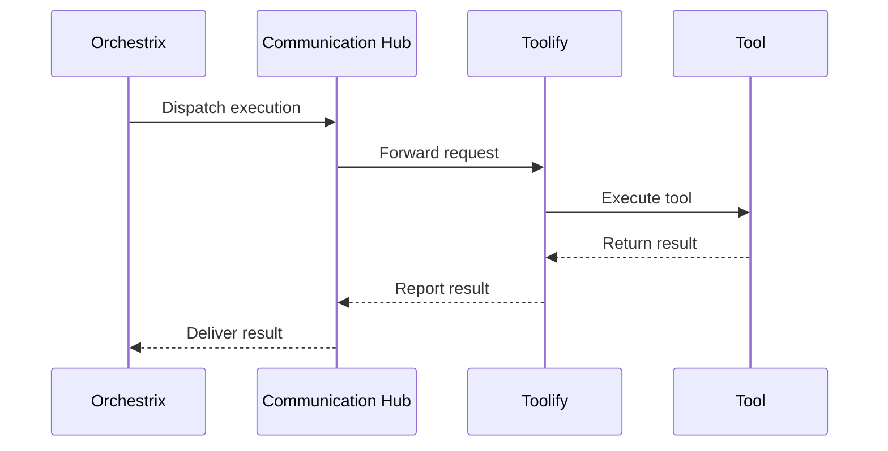
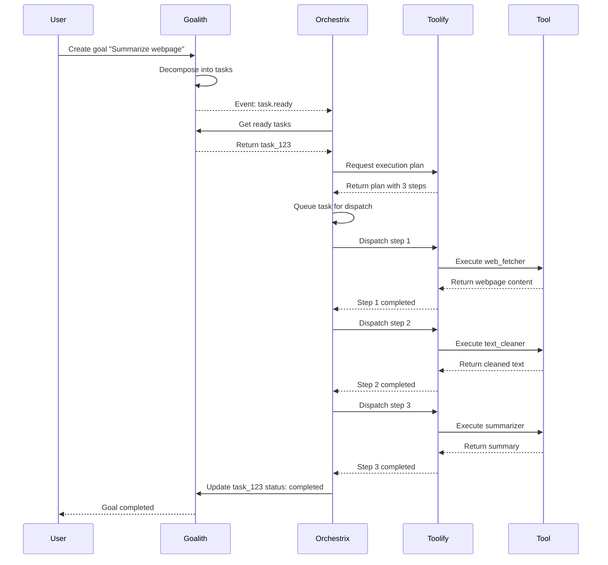

# RFC-0004: Orchestrix — Workflow Orchestration & Coordination

**Status**: Draft
**Authors**: Noesium Team
**Created**: 2026-01-26
**Last Updated**: 2026-01-26
**Depends on**: [RFC-0001](rfc-0001.md), [RFC-0002](rfc-0002.md), [RFC-0003](rfc-0003.md)
**Supersedes**: —
**Stage**: Core Engine

---

## 1. Abstract

Orchestrix is the multi-agent orchestration system that bridges and coordinates workflows between Goalith and Toolify. It fetches executable goals from Goalith, queries Toolify for suitable tools, dispatches execution requests, and handles status feedback. Orchestrix owns the Communication Hub for inter-component messaging and manages execution scheduling (queue management, dispatch timing).

---

## 2. Scope and Non-Goals

### 2.1 Scope

This RFC defines:

* Task fetching and coordination from Goalith
* Tool discovery and execution plan requests to Toolify
* Execution dispatch and monitoring
* Status aggregation and feedback to Goalith
* Communication Hub for inter-component messaging
* Execution scheduling (queue management, dispatch timing)
* Replanning triggers and coordination
* Pub/sub event model for notifications

### 2.2 Non-Goals

This RFC does **not** define:

* Goal decomposition or DAG management (see [RFC-0002](rfc-0002.md))
* Tool registration or adapter implementations (see [RFC-0003](rfc-0003.md))
* Task priority/readiness determination (handled by Goalith)
* Tool execution internals (handled by Toolify)

---

## 3. Background & Motivation

In a multi-agent system, goals and tools exist in separate domains:
- **Goalith** knows what needs to be done (goals, tasks, dependencies)
- **Toolify** knows how to do things (tools, capabilities, execution)

A coordination layer is needed to:
1. Bridge goal-level planning with tool-level execution
2. Manage the execution lifecycle from task to result
3. Handle failures and trigger replanning
4. Provide real-time visibility into workflow progress

Orchestrix serves as this coordination layer, acting as the central hub for workflow execution.

---

## 4. Design Principles

1. **Single Responsibility**: Orchestrix coordinates; it does not decompose goals or execute tools.

2. **Communication Hub Ownership**: Orchestrix owns the Communication Hub for all inter-component messaging, ensuring centralized coordination.

3. **Execution Scheduling**: Orchestrix manages when and how ready tasks are dispatched, complementing Goalith's readiness determination.

4. **Event-Driven**: Uses pub/sub patterns for loose coupling with other components.

5. **Resilient Feedback Loop**: Continuous monitoring with automatic replanning on failures.

---

## 5. Core Components

### 5.1 Task Fetching & Coordination

**Purpose**: Retrieve and manage executable tasks from Goalith.

**Goalith Integration**:
- Query Goalith for tasks with status `ready`
- Respect task dependencies and priorities from Goalith
- Track task lifecycle from ready to completed/failed

**Task Queueing**:
- Tasks are placed in a priority queue
- Queue respects Goalith's priority assignments
- Supports concurrent task processing limits

**Execution Scheduling**:
- Determines dispatch timing based on resource availability
- Manages concurrent execution limits
- Handles rate limiting and backpressure

**Boundary Clarification**:
- **Goalith** determines task readiness and priority within the DAG
- **Orchestrix** determines when and how to dispatch ready tasks

### 5.2 Tool Discovery & Execution Plan Request

**Purpose**: Request execution plans from Toolify for ready tasks.

**Workflow**:
1. For each ready task, extract required capabilities
2. Query Toolify to find suitable tools
3. Request execution plan from Toolify's Execution Planner
4. Validate plan before dispatch

**Example Request to Toolify**:

```json
{
  "task_id": "task_123",
  "capabilities_needed": ["text_cleaning", "summarization"],
  "params": { "text": "Long document content..." }
}
```

**Example Response from Toolify**:

```json
{
  "task_id": "task_123",
  "plan_id": "plan_456",
  "steps": [
    { "step_id": 1, "tool_id": "text_cleaner_v1" },
    { "step_id": 2, "tool_id": "summarizer_v2", "depends_on": [1] }
  ]
}
```

### 5.3 Execution Dispatch

**Purpose**: Send execution commands to Toolify and manage execution lifecycle.

**Communication Hub**:
Orchestrix owns the Communication Hub for inter-component messaging:
- Routes execution requests to Toolify
- Receives execution results and status updates
- Broadcasts events to subscribers
- Manages message queues and delivery guarantees

**Dispatch Flow**:



**Subagent Interaction**:
When tools are subagents (via Toolify's SubagentAdapter):
- Orchestrix dispatches like any other tool
- Toolify handles agent-specific execution
- Results flow back through the same channel

### 5.4 Status Aggregation & Feedback

**Purpose**: Collect execution feedback and update Goalith.

**Execution Monitoring**:
- Track execution status (success, failure, timeout)
- Collect intermediate results
- Measure execution metrics (duration, resource usage)

**Status Updates to Goalith**:
All status updates use standardized values from [RFC-0001](rfc-0001.md):

| Status | When Used |
|--------|-----------|
| `pending` | Task created, waiting on dependencies |
| `ready` | Dependencies complete, awaiting dispatch |
| `in_progress` | Execution dispatched, running |
| `completed` | Execution successful |
| `failed` | Execution failed |
| `cancelled` | Task cancelled |

**Result Aggregation**:
- Collect results from multi-step execution plans
- Aggregate partial results for reporting
- Store execution artifacts for debugging

### 5.5 Replanning Mechanism

**Purpose**: Detect failures and trigger replanning.

**Failure Detection**:
- Tool execution failures
- Timeout violations
- Resource exhaustion
- Unexpected status transitions

**Replanning Triggers**:
- Notify Goalith of task failures
- Request alternative tool selection from Toolify
- Re-prioritize remaining tasks

**Adaptive Scheduling**:
- Adjust task queue based on failures
- Implement retry policies with backoff
- Circuit breaker for repeatedly failing tools

### 5.6 Communication Hub

**Purpose**: Central messaging infrastructure for inter-component communication.

**Note**: The Communication Hub is owned by Orchestrix, not Toolify. This ensures centralized coordination and prevents circular dependencies.

**Capabilities**:
- Request/response messaging
- Pub/sub event broadcasting
- Message persistence and replay
- Delivery guarantees (at-least-once, at-most-once)

**Event Types**:

| Event | Publisher | Subscribers |
|-------|-----------|-------------|
| `task.ready` | Goalith | Orchestrix |
| `task.status_changed` | Orchestrix | Goalith, Monitors |
| `execution.started` | Toolify | Orchestrix, Monitors |
| `execution.completed` | Toolify | Orchestrix |
| `execution.failed` | Toolify | Orchestrix |
| `replan.triggered` | Orchestrix | Goalith |

### 5.7 Pub/Sub Event Model

**Purpose**: Enable loose coupling through event-driven notifications.

**Event Schema**:

```json
{
  "event_id": "evt_789",
  "event_type": "task.status_changed",
  "timestamp": "2026-01-26T10:30:00Z",
  "source": "orchestrix",
  "payload": {
    "task_id": "task_123",
    "old_status": "in_progress",
    "new_status": "completed",
    "result": { "summary": "..." }
  }
}
```

**Subscription Management**:
- Components subscribe to event types
- Supports pattern matching (e.g., `task.*`)
- Configurable delivery (sync, async, batched)

---

## 6. API Layer

Orchestrix exposes REST API endpoints for interaction with Goalith, Toolify, and external systems.

### 6.1 Task Fetching

**Endpoint**: `GET /tasks/ready`

**Response**:
```json
{
  "tasks": [
    {
      "task_id": "task_123",
      "goal_id": "goal_001",
      "status": "ready",
      "priority": 10
    }
  ]
}
```

### 6.2 Tool Discovery & Plan Generation

**Endpoint**: `POST /execution/plan`

**Request**:
```json
{
  "task_id": "task_123",
  "capabilities_needed": ["text_cleaning", "summarization"]
}
```

**Response**:
```json
{
  "plan_id": "plan_456",
  "steps": [
    { "step_id": 1, "tool_id": "text_cleaner_v1" },
    { "step_id": 2, "tool_id": "summarizer_v2" }
  ]
}
```

### 6.3 Execution Dispatch

**Endpoint**: `POST /execution/dispatch`

**Request**:
```json
{
  "task_id": "task_123",
  "plan_id": "plan_456"
}
```

**Response**:
```json
{
  "execution_id": "exec_789",
  "status": "in_progress"
}
```

### 6.4 Status Updates

**Endpoint**: `POST /tasks/status`

**Request**:
```json
{
  "task_id": "task_123",
  "status": "completed",
  "result": {
    "summary": "The research paper discusses..."
  }
}
```

### 6.5 Replanning Trigger

**Endpoint**: `POST /replan`

**Request**:
```json
{
  "task_id": "task_123",
  "reason": "execution_failure",
  "details": {
    "failed_tool": "summarizer_v2",
    "error": "timeout"
  }
}
```

### 6.6 Event Subscription

**Endpoint**: `POST /events/subscribe`

**Request**:
```json
{
  "subscriber_id": "monitor_001",
  "event_patterns": ["task.*", "execution.failed"],
  "callback_url": "https://monitor.example.com/webhook"
}
```

---

## 7. Technology Stack

| Component | Suggested Technology |
|-----------|---------------------|
| API Layer | FastAPI / Flask / Express |
| Task Queueing | Redis / Celery |
| Event System | RabbitMQ / Kafka / WebSockets |
| Execution Logic | Python (asyncio, subprocess) |
| Monitoring | OpenTelemetry, Prometheus, Grafana |
| Database | PostgreSQL / SQLite |

---

## 8. Examples

### 8.1 Complete Workflow Example



### 8.2 Failure and Replanning Example

```json
{
  "event_type": "execution.failed",
  "task_id": "task_123",
  "step_id": 2,
  "tool_id": "summarizer_v2",
  "error": {
    "type": "timeout",
    "message": "Execution exceeded 60s limit"
  }
}
```

**Orchestrix Response**:
1. Log failure event
2. Check retry policy (max 3 retries)
3. If retries exhausted, trigger replan
4. Notify Goalith of failure
5. Request alternative tool from Toolify

---

## 9. Relationship to Other RFCs

* **[RFC-0001](rfc-0001.md)**: Defines overall system architecture and standardized status values
* **[RFC-0002](rfc-0002.md)**: Goalith provides ready tasks; Orchestrix updates task status
* **[RFC-0003](rfc-0003.md)**: Toolify provides execution plans and executes tools; Orchestrix dispatches requests

**Responsibility Boundaries**:

| Concern | Owner |
|---------|-------|
| Goal decomposition | Goalith |
| Task readiness & priority | Goalith |
| Tool registration | Toolify |
| Execution planning | Toolify |
| Tool execution | Toolify |
| Workflow coordination | Orchestrix |
| Execution scheduling | Orchestrix |
| Communication Hub | Orchestrix |
| Status aggregation | Orchestrix |

---

## 10. Open Questions

* How should Orchestrix handle long-running tasks that span multiple sessions?
* What persistence guarantees are needed for the Communication Hub?
* How should distributed Orchestrix instances coordinate?

---

## 11. Future Enhancements

* **Self-Healing Orchestration**: Auto-resolve failures and select alternative execution paths
* **Advanced Scheduling**: Implement resource-based scheduling and load balancing
* **Distributed Execution**: Extend orchestration to multi-machine, multi-cluster environments
* **Workflow Templates**: Predefined workflow patterns for common scenarios
* **Execution Checkpointing**: Save execution state for resumption after failures

---

## 12. Conclusion

Orchestrix serves as the central coordinator in the Noesium multi-agent system, bridging Goalith's goal management with Toolify's tool execution. By owning the Communication Hub and managing execution scheduling, Orchestrix ensures efficient, scalable, and adaptable task execution while maintaining clear separation of concerns with other components.

> **Orchestrix: The coordination backbone for multi-agent workflows**
