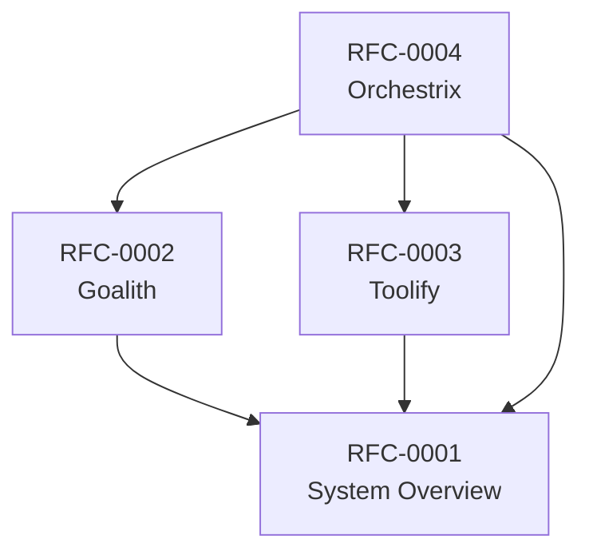

# RFC Index

This document provides a comprehensive index of all RFCs in the Noesium project.

---

## Active RFCs

| RFC | Title | Status | Depends On | Last Updated |
|-----|-------|--------|------------|--------------|
| [RFC-0001](rfc-0001.md) | Noesium System Overview | Draft | — | 2026-01-26 |
| [RFC-0002](rfc-0002.md) | Goalith — DAG-Based Goal & Task Management | Draft | RFC-0001 | 2026-01-26 |
| [RFC-0003](rfc-0003.md) | Toolify — Tool Management System | Draft | RFC-0001 | 2026-01-26 |
| [RFC-0004](rfc-0004.md) | Orchestrix — Workflow Orchestration & Coordination | Draft | RFC-0001, RFC-0002, RFC-0003 | 2026-01-26 |

---

## RFC Dependency Graph

---

## RFC Categories

### Core Engine

| RFC | Title | Description |
|-----|-------|-------------|
| [RFC-0001](rfc-0001.md) | System Overview | High-level architecture and component boundaries |
| [RFC-0002](rfc-0002.md) | Goalith | DAG-based goal and task management |
| [RFC-0003](rfc-0003.md) | Toolify | Tool registration, execution planning, and adapters |
| [RFC-0004](rfc-0004.md) | Orchestrix | Workflow orchestration and coordination |

---

## Special RFCs

| RFC | Title | Description |
|-----|-------|-------------|
| [rfc-specifications.md](rfc-specifications.md) | RFC Specifications & Management Guide | Process and conventions for creating RFCs |
| [rfc-namings.md](rfc-namings.md) | Naming Standards | Authoritative naming reference |

---

## Version History

| Date | Changes |
|------|---------|
| 2026-01-26 | Initial index with RFC-0001 through RFC-0004 |

---

## Quick Reference

### Status Values

- **Draft**: Work in progress, subject to change
- **Frozen**: Immutable production reference

### How to Add New RFCs

1. Create new file: `rfc-NNNN.md` (next sequential number)
2. Follow template in [rfc-specifications.md](rfc-specifications.md)
3. Update this index with new entry
4. Submit for review

### Related Documents

- [RFC Specifications](rfc-specifications.md) — Process and template guide
- [Naming Standards](rfc-namings.md) — Naming conventions
