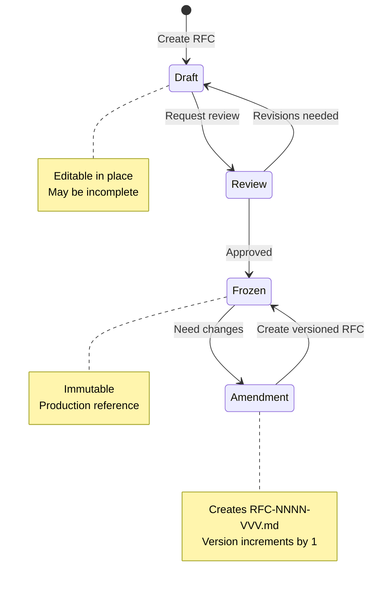
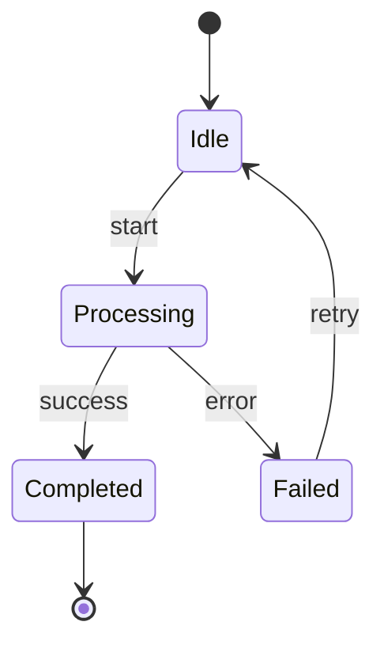
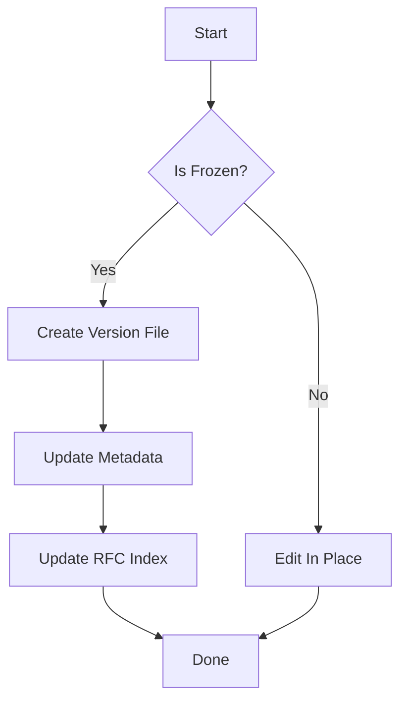
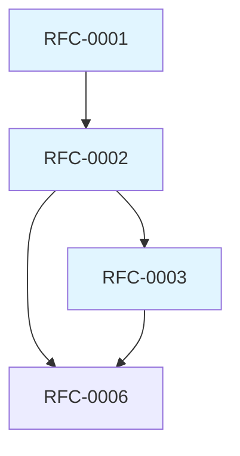

# RFC Specifications & Management Guide

This document defines the process, conventions, and guidelines for creating and managing RFCs (Requests for Comments) in the Noesium project.

---

## Table of Contents

1. [Overview](#overview)
2. [RFC Process](#rfc-process)
3. [Naming Conventions](#naming-conventions)
4. [Status Management](#status-management)
5. [Versioning Rules](#versioning-rules)
6. [RFC Template](#rfc-template)
7. [Best Practices](#best-practices)

---

## Overview

RFCs are the authoritative specifications for the Noesium system. They define:

- Core architectural decisions
- Data models and semantics
- API contracts and interfaces
- System behavior and invariants

RFCs serve as:

- **Design documents** during development
- **Implementation contracts** for engineers
- **Reference documentation** for users
- **Historical record** of design decisions

---

## RFC Process

### When to Create an RFC

Create an RFC when:

- Defining a new subsystem or layer (e.g., storage, execution)
- Specifying public API contracts
- Establishing semantic guarantees or invariants
- Making cross-cutting architectural decisions
- Proposing significant changes to frozen RFCs

Do NOT create an RFC for:

- Implementation details that don't affect contracts
- Internal optimizations invisible to other layers
- Temporary workarounds or experiments
- Documentation updates without semantic changes

### RFC Lifecycle



#### Stage 1: Draft

- RFC is created with `Status: Draft`
- Author iterates on design
- May be edited freely in place
- Incomplete sections are acceptable
- Other engineers may provide feedback

#### Stage 2: Review

- Author requests review when RFC is complete
- Core team reviews for:
  - Completeness
  - Consistency with other RFCs
  - Technical correctness
  - Clarity and readability

#### Stage 3: Frozen

- RFC is marked `Status: Frozen`
- Becomes immutable production reference
- Implementation may begin or continue
- Any changes require creating a versioned update

### Who Can Freeze an RFC

- Core team members with architecture responsibility
- Project maintainers
- Requires consensus among reviewers

---

## Naming Conventions

### Numbered RFCs

**Format**: `rfc-NNNN.md`

- `NNNN`: 4-digit zero-padded number (0001, 0002, etc.)
- Sequential numbering
- Numbers are reserved once assigned, even if RFC is deleted

**Examples**:
- `rfc-0001.md` - First RFC
- `rfc-0042.md` - Forty-second RFC
- `rfc-0100.md` - One hundredth RFC

### Special RFCs

**Format**: `rfc-{name}.md`

Used for cross-cutting or unique RFCs that don't fit sequential numbering.

**Examples**:
- `rfc-namings.md` - Authoritative naming reference
- `rfc-glossary.md` - Terminology definitions (future)
- `rfc-index.md` - RFC index (this should use the index doc instead)

### Versioned RFC Updates

**Format**: `rfc-NNNN-VVV.md`

- `NNNN`: Original RFC number (4-digit padded)
- `VVV`: Version number (3-digit padded, starting at 001)
- Used only for updates to frozen RFCs

**Examples**:
- `rfc-0001-001.md` - First update to RFC-0001
- `rfc-0001-002.md` - Second update to RFC-0001
- `rfc-0042-015.md` - Fifteenth update to RFC-0042

---

## Status Management

### Status Values

An RFC must have exactly one of these statuses:

#### Draft

**Meaning**: Work in progress, subject to change

**Characteristics**:
- May be edited in place
- May have incomplete sections
- Not yet authoritative for implementation
- May reference other Draft RFCs

**When to use**: All new RFCs start as Draft

#### Frozen

**Meaning**: Immutable production reference

**Characteristics**:
- Cannot be edited (file is immutable)
- Authoritative for implementation
- Updates create new versioned files
- Should be complete and reviewed

**When to use**: When RFC is complete, reviewed, and approved

### Changing Status

#### Draft → Frozen

1. Ensure RFC is complete
2. Request review from core team
3. Address review feedback
4. Update status to `Status: Frozen`
5. Commit with message: `docs: freeze RFC-NNNN`

#### Frozen → Amendment

Frozen RFCs cannot have their status changed. To update:

1. Create new file `rfc-NNNN-VVV.md`
2. Copy full content from original
3. Make necessary changes
4. Update metadata (see Versioning Rules)
5. Commit with message: `docs: add RFC-NNNN version VVV`

---

## Versioning Rules

### For Draft RFCs

- Edit in place
- Update `Last Updated` field when making changes
- No version numbers needed
- Once frozen, versioning rules apply

### For Frozen RFCs

Frozen RFCs are **immutable**. To make updates:

#### Step 1: Create Version File

Create a new file: `rfc-NNNN-VVV.md`

- `VVV` is the next sequential version (001, 002, 003...)
- If no versions exist, first version is 001
- If `rfc-0001-003.md` exists, next version is 004

#### Step 2: Copy Full Content

Version files contain the **complete RFC**, not just diffs.

- Copy entire content from parent RFC or previous version
- Make your changes to the copy
- Version file is standalone and complete

#### Step 3: Update Metadata

Versioned RFCs use different metadata:

```markdown
# RFC-NNNN-VVV: [Title] (Update [V])

**Status**: Frozen
**Parent RFC**: RFC-NNNN
**Version**: VVV
**Authors**: [Author names]
**Created**: YYYY-MM-DD
**Changes**: Brief summary of what changed in this version
**Supersedes**: RFC-NNNN or RFC-NNNN-002
**Depends on**: [Same as parent or updated]
```

#### Step 4: Version Increment Rules

- Versions are sequential: 001, 002, 003, ...
- No gaps in version numbers
- Version 001 supersedes the base RFC-NNNN
- Version 002 supersedes RFC-NNNN-001
- And so on

#### Step 5: Update RFC Index

Add version entry to [rfc-index.md](rfc-index.md):

```markdown
| RFC | Title | Versions | ... |
| RFC-0001 | Title | [v001](rfc-0001-001.md), [v002](rfc-0001-002.md) | ... |
```

### Why Full Content, Not Diffs?

- Each version is a complete, standalone reference
- Readers don't need to reconstruct content from patches
- Versions can be read independently
- Simpler tooling and workflows
- Clear historical record

---

## RFC Template

Use this template when creating new RFCs:

```markdown
# RFC-NNNN: [Title]

**Status**: Draft
**Authors**: [Your name(s)]
**Created**: YYYY-MM-DD
**Last Updated**: YYYY-MM-DD
**Depends on**: [RFC-XXXX, RFC-YYYY, or "—" if none]
**Supersedes**: [RFC-ZZZZ or "—" if none]
**Stage**: [Optional: Core Engine | Storage | Distributed | API | etc.]

---

## 1. Abstract

[2-4 sentences summarizing what this RFC defines and why it matters]

---

## 2. Scope and Non-Goals

### 2.1 Scope

This RFC defines:

* [What is specified]
* [Key concepts covered]
* [Boundaries of specification]

### 2.2 Non-Goals

This RFC does **not** define:

* [What is explicitly excluded]
* [What is covered by other RFCs]
* [Future work not in scope]

---

## 3. Background & Motivation

[Why is this RFC needed? What problem does it solve?]

---

## 4. Design Principles

[Core principles guiding the design, typically 3-5 items]

1. **Principle 1**: Description
2. **Principle 2**: Description
3. **Principle 3**: Description

---

## 5. [Main Content Sections]

[Organize your specification into logical sections]

### 5.1 [Subsection]

[Detailed specification content]

---

## 6. Examples

[Concrete examples demonstrating the specification]

---

## 7. Relationship to Other RFCs

[How this RFC relates to and depends on other RFCs]

* **RFC-XXXX**: [Relationship]
* **RFC-YYYY**: [Relationship]

---

## 8. Open Questions

[Optional: Unresolved questions or future work]

* [Question 1]
* [Question 2]

---

## 9. Conclusion

[1-2 paragraphs summarizing the key takeaways]

> **Optional quotable summary of the RFC's core contribution**
```

### Template for Versioned RFCs

```markdown
# RFC-NNNN-VVV: [Title] (Update [V])

**Status**: Frozen
**Parent RFC**: RFC-NNNN
**Version**: VVV
**Authors**: [Author names]
**Created**: YYYY-MM-DD
**Changes**: [Brief summary of what changed in this version]
**Supersedes**: RFC-NNNN or RFC-NNNN-002
**Depends on**: [RFC-XXXX, RFC-YYYY]

---

## Changes in This Version

[Detailed description of changes from previous version]

### Modified Sections

- **Section X**: [What changed and why]
- **Section Y**: [What changed and why]

### New Sections

- **Section Z**: [What was added and why]

### Deprecated Content

- **Section W**: [What was removed and why]

---

[Full RFC content follows - complete document, not diffs]

## 1. Abstract

[...]
```

---

## Best Practices

### Writing Style

1. **Be precise**: Use normative keywords (MUST, SHOULD, MAY) consistently
2. **Be clear**: Avoid ambiguity; prefer explicit specifications
3. **Be complete**: Cover all relevant cases and edge conditions
4. **Be concise**: Remove unnecessary words; focus on content
5. **Use examples**: Illustrate complex concepts with concrete examples

### Normative Keywords

Follow RFC 2119 conventions:

- **MUST / REQUIRED / SHALL**: Absolute requirement
- **MUST NOT / SHALL NOT**: Absolute prohibition
- **SHOULD / RECOMMENDED**: Strong recommendation, exceptions possible
- **SHOULD NOT / NOT RECOMMENDED**: Strong discouragement
- **MAY / OPTIONAL**: Truly optional

### Structure

- Use consistent heading levels
- Group related concepts together
- Put foundational concepts before advanced topics
- Include a Table of Contents for long RFCs (>1000 lines)
- Use tables for comparisons and categorization
- Use code blocks for syntax and examples
- Use diagrams (mermaid) for complex relationships

### Dependencies

- Explicitly list all RFC dependencies in metadata
- Reference specific sections when citing other RFCs
- Avoid circular dependencies
- Prefer depending on frozen RFCs over drafts

### Cross-References

Use markdown links for all RFC references:

- Link to RFCs: `[RFC-0001](rfc-0001.md)`
- Link to sections: `[RFC-0001, Section 4](rfc-0001.md#4-design-principles)`
- Link to versions: `[RFC-0001-v002](rfc-0001-002.md)`

### Diagrams

Use mermaid for visualizations:

- **Flowcharts**: Process flows and decision trees
- **State diagrams**: Lifecycles and state machines
- **Graph diagrams**: Dependencies and relationships
- **Sequence diagrams**: Interactions and protocols

Keep diagrams simple and focused on one concept.

### Code Examples

- Use syntax highlighting with language tags
- Keep examples minimal and focused
- Show both correct and incorrect usage when helpful
- Include comments explaining non-obvious aspects

### Tables

Use tables for:

- Categorization and taxonomy
- Comparisons between alternatives
- Lists of operators, types, or functions
- Status and version tracking

---

## Metadata Fields Reference

### Required Fields (All RFCs)

| Field | Format | Description |
|-------|--------|-------------|
| `Status` | `Draft` or `Frozen` | Current RFC status |
| `Authors` | Free text | RFC author(s) |
| `Created` | `YYYY-MM-DD` | Date RFC was created |
| `Last Updated` | `YYYY-MM-DD` | Date of most recent change |
| `Depends on` | `RFC-XXXX, RFC-YYYY` or `—` | RFC dependencies |
| `Supersedes` | `RFC-ZZZZ` or `—` | RFC this replaces |

### Optional Fields

| Field | Format | Description |
|-------|--------|-------------|
| `Stage` | Free text | Development stage or subsystem |

### Additional Fields (Versioned RFCs Only)

| Field | Format | Description |
|-------|--------|-------------|
| `Parent RFC` | `RFC-NNNN` | Original RFC being updated |
| `Version` | `VVV` | Version number (001, 002, etc.) |
| `Changes` | Free text | Summary of changes in this version |

---

## FAQ

### Q: When should I freeze an RFC?

**A**: Freeze an RFC when:
- Implementation is starting or in progress
- Other RFCs need to depend on it with stability
- The design is reviewed and approved
- You want to prevent accidental changes

### Q: Can I edit a frozen RFC to fix typos?

**A**: No. Even typo fixes require creating a new version. This preserves the historical record and ensures immutability.

### Q: What if I need to make a small change to a frozen RFC?

**A**: Create a new version (`rfc-NNNN-001.md`) with the full content. Even small changes require versions. This maintains consistency and traceability.

### Q: How do I know what version number to use?

**A**: Find the highest existing version and add 1. If no versions exist, use 001. Check both the filesystem and [rfc-index.md](rfc-index.md).

### Q: Can I skip version numbers?

**A**: No. Versions must be sequential with no gaps (001, 002, 003, ...).

### Q: Should I delete old versions?

**A**: No. Keep all versions for historical reference and traceability.

### Q: What if my RFC depends on a Draft RFC?

**A**: That's fine while both are drafts. Consider:
- Freezing dependencies first
- Moving both forward together
- Merging related drafts

### Q: Can I reorganize section numbers in a version update?

**A**: Yes, versioned RFCs can have different structures. Document structural changes in the "Changes in This Version" section.

### Q: How do I handle breaking changes?

**A**: Create a new version and:
- Clearly document breaking changes in "Changes" section
- Provide migration guidance
- Consider deprecation period if widely implemented
- Update dependent RFCs if needed

---

## Version History

This document itself follows RFC versioning principles.

| Version | Date | Changes |
|---------|------|---------|
| Initial | 2026-01-22 | Initial RFC specifications guide |

---

## Related Documents

- **RFC Index**: [rfc-index.md](rfc-index.md) - Comprehensive index of all RFCs
- **RFC History**: [rfc-history.md](rfc-history.md) - Chronological record of RFC lifecycle events
- **Naming Standards**: [rfc-namings.md](rfc-namings.md) - Authoritative naming reference
- **Architecture Design**: [rfc-0100.md](rfc-0100.md) - Overall system architecture

---

## Appendix: Mermaid Diagram Examples

### Example 1: State Diagram



### Example 2: Flowchart



### Example 3: Graph (Dependencies)



---

**For questions or clarifications about RFC management, contact the Noesium core team.**
