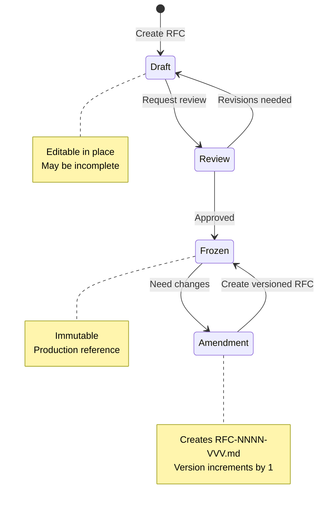

# RFC Specifications & Management Guide

This document defines the process, conventions, and guidelines for creating and managing RFCs (Requests for Comments) in the noesium project.

---

## Table of Contents

1. [Overview](#overview)
2. [Spec Kinds](#spec-kinds)
3. [RFC Process](#rfc-process)
4. [Naming Conventions](#naming-conventions)
5. [Status Management](#status-management)
6. [Versioning Rules](#versioning-rules)
7. [RFC Template](#rfc-template)
8. [Best Practices](#best-practices)
9. [Metadata Fields Reference](#metadata-fields-reference)
10. [FAQ](#faq)

---

## Overview

RFCs are the authoritative specifications for the noesium system. They define:

- Core architectural decisions
- Data models and semantics
- API contracts and interfaces
- System behavior and invariants

RFCs serve as:

- **Design documents** during development
- **Implementation contracts** for engineers
- **Reference documentation** for users
- **Historical record** of design decisions

---

## Spec Kinds

noesium RFCs fall into three kinds, each with a distinct purpose and level of abstraction:

### Conceptual Design

**Purpose**: Define the system's vision, principles, taxonomy, and invariants.

**Contains**:
- System goals and design philosophy
- Fundamental abstractions and conceptual model
- Core terminology and taxonomy
- System-wide invariants

**Does NOT contain**: Schemas, APIs, code, storage formats, component boundaries.

**When to use**: Starting a new system or subsystem; defining foundational concepts that other specs depend on.

### Architecture Design

**Purpose**: Define components, layers, responsibilities, data flow, and constraints.

**Contains**:
- Component/module structure and responsibilities
- Data flow between components
- Invariants (MUST/MUST NOT rules)
- Abstract schemas and dependency constraints

**Does NOT contain**: Concrete API signatures, language-specific code, implementation details.

**When to use**: Designing system architecture, layer boundaries, storage models, or subsystem structure.

### Implementation Interface Design

**Purpose**: Define API contracts, naming conventions, and interface signatures.

**Contains**:
- Naming patterns and conventions
- Type/struct definitions
- Trait/interface signatures
- Error handling patterns and flow control semantics

**May be language-specific**: Code blocks in the target language are appropriate.

**When to use**: Defining cross-component API contracts, data access patterns, or shared interfaces.

### Dependency Flow Between Kinds

```
Conceptual Design → Architecture Design → Implementation Interface Design
```

Each kind builds on the previous. Conceptual specs typically have no RFC dependencies; architecture specs depend on conceptual; impl-interface specs depend on architecture. This is guidance, not a hard rule.

---

## RFC Process

### When to Create an RFC

Create an RFC when:

- Defining a new subsystem or layer
- Specifying public API contracts
- Establishing semantic guarantees or invariants
- Making cross-cutting architectural decisions
- Proposing significant changes to frozen RFCs

Do NOT create an RFC for:

- Implementation details that don't affect contracts
- Internal optimizations invisible to other layers
- Temporary workarounds or experiments
- Documentation updates without semantic changes

### RFC Lifecycle



#### Stage 1: Draft

- RFC is created with `Status: Draft`
- Author iterates on design
- May be edited freely in place
- Incomplete sections are acceptable
- Other engineers may provide feedback

#### Stage 2: Review

- Author requests review when RFC is complete
- Core team reviews for:
  - Completeness
  - Consistency with other RFCs
  - Technical correctness
  - Clarity and readability

#### Stage 3: Frozen

- RFC is marked `Status: Frozen`
- Becomes immutable production reference
- Implementation may begin or continue
- Any changes require creating a versioned update

### Who Can Freeze an RFC

- Core team members with architecture responsibility
- Project maintainers
- Requires consensus among reviewers

---

## Naming Conventions

### Numbered RFCs

**Format**: `RFC-NNNN.md`

- `NNNN`: 4-digit zero-padded number (0001, 0002, etc.)
- Sequential numbering
- Numbers are reserved once assigned, even if RFC is deleted

**Examples**:
- `RFC-0001.md` - First RFC
- `RFC-0042.md` - Forty-second RFC
- `RFC-0100.md` - One hundredth RFC

### Special RFCs

**Format**: `rfc-{name}.md`

Used for cross-cutting RFCs: `rfc-namings.md`, `rfc-index.md`, etc.

### Versioned RFC Updates

**Format**: `RFC-NNNN-VVV.md`

- `NNNN`: Original RFC number (4-digit padded)
- `VVV`: Version number (3-digit padded, starting at 001)
- Used only for updates to frozen RFCs

**Examples**:
- `RFC-0001-001.md` - First update to RFC-0001
- `RFC-0001-002.md` - Second update to RFC-0001
- `RFC-0042-015.md` - Fifteenth update to RFC-0042

---

## Status Management

### Status Values

| Status | Meaning | Editable? |
|--------|---------|-----------|
| **Draft** | Work in progress | Yes |
| **Review** | Ready for review | Yes (with feedback) |
| **Frozen** | Immutable production reference | No (create version) |
| **Deprecated** | No longer active | No |

### Changing Status

- **Draft → Review**: Complete the RFC, update status, request review
- **Review → Frozen**: Address feedback, ensure consensus, update status, commit with `docs: freeze RFC-NNNN`
- **Frozen → Amendment**: Create new file `RFC-NNNN-VVV.md` with full content, commit with `docs: add RFC-NNNN version VVV`

---

## Versioning Rules

### For Draft and Review RFCs

- Edit in place
- Update `Last Updated` field when making changes
- No version numbers needed
- Once frozen, versioning rules apply

### For Frozen RFCs

Frozen RFCs are **immutable**. To make updates:

1. Create `RFC-NNNN-VVV.md` (next sequential version; first version is 001)
2. Copy full content from original (version files are standalone and complete, not diffs)
3. Make changes
4. Update metadata:

```markdown
# RFC-NNNN-VVV: [Title] (Update [V])

**Status**: Frozen
**Parent RFC**: RFC-NNNN
**Version**: VVV
**Authors**: [Author names]
**Created**: YYYY-MM-DD
**Changes**: [Brief summary]
**Supersedes**: RFC-NNNN or RFC-NNNN-002
**Depends on**: [RFC-XXXX, RFC-YYYY]
```

5. Update [rfc-index.md](rfc-index.md) with the new version entry

### Version Increment Rules

- Versions are sequential: 001, 002, 003, ...
- No gaps in version numbers
- Version 001 supersedes the base RFC-NNNN
- Version 002 supersedes RFC-NNNN-001
- And so on

---

## RFC Template

Use this template when creating new RFCs:

```markdown
# RFC-NNNN: [Title]

**Status**: Draft
**Authors**: [Your name(s)]
**Created**: YYYY-MM-DD
**Last Updated**: YYYY-MM-DD
**Depends on**: [RFC-XXXX, RFC-YYYY, or "---" if none]
**Supersedes**: [RFC-ZZZZ or "---" if none]
**Stage**: [Optional: e.g. Core | Storage | API]
**Kind**: [Conceptual Design | Architecture Design | Implementation Interface Design]

---

## 1. Abstract

[2-4 sentences summarizing what this RFC defines and why it matters]

---

## 2. Scope and Non-Goals

### 2.1 Scope

This RFC defines:
* [What is specified]
* [Key concepts covered]
* [Boundaries of specification]

### 2.2 Non-Goals

This RFC does **not** define:
* [What is explicitly excluded]
* [What is covered by other RFCs]
* [Future work not in scope]

---

## 3. Background & Motivation

[Why is this RFC needed? What problem does it solve?]

---

## 4. Design Principles

[Core principles guiding the design, typically 3-5 items]

1. **Principle 1**: Description
2. **Principle 2**: Description
3. **Principle 3**: Description

---

## 5. [Main Content Sections]

[Organize your specification into logical sections]

### 5.1 [Subsection]

[Detailed specification content]

---

## 6. Examples

[Concrete examples demonstrating the specification]

---

## 7. Relationship to Other RFCs

[How this RFC relates to and depends on other RFCs]

* **RFC-XXXX**: [Relationship]
* **RFC-YYYY**: [Relationship]

---

## 8. Open Questions

[Optional: Unresolved questions or future work]

* [Question 1]
* [Question 2]

---

## 9. Conclusion

[1-2 paragraphs summarizing the key takeaways]

> **Optional quotable summary of the RFC's core contribution**
```

### Template for Versioned RFCs

```markdown
# RFC-NNNN-VVV: [Title] (Update [V])

**Status**: Frozen
**Parent RFC**: RFC-NNNN
**Version**: VVV
**Authors**: [Author names]
**Created**: YYYY-MM-DD
**Changes**: [Brief summary of what changed in this version]
**Supersedes**: RFC-NNNN or RFC-NNNN-002
**Depends on**: [RFC-XXXX, RFC-YYYY]

---

## Changes in This Version

[Detailed description of changes from previous version]

### Modified Sections

- **Section X**: [What changed and why]
- **Section Y**: [What changed and why]

### New Sections

- **Section Z**: [What was added and why]

### Deprecated Content

- **Section W**: [What was removed and why]

---

[Full RFC content follows - complete document, not diffs]

## 1. Abstract

[...]
```

---

## Best Practices

### Writing Style

1. **Be precise**: Use normative keywords (MUST, SHOULD, MAY) consistently
2. **Be clear**: Avoid ambiguity; prefer explicit specifications
3. **Be complete**: Cover all relevant cases and edge conditions
4. **Be concise**: Remove unnecessary words; focus on content
5. **Use examples**: Illustrate complex concepts with concrete examples

### Normative Keywords

Follow RFC 2119 conventions:

- **MUST / REQUIRED / SHALL**: Absolute requirement
- **MUST NOT / SHALL NOT**: Absolute prohibition
- **SHOULD / RECOMMENDED**: Strong recommendation, exceptions possible
- **SHOULD NOT / NOT RECOMMENDED**: Strong discouragement
- **MAY / OPTIONAL**: Truly optional

### Structure

- Use consistent heading levels
- Group related concepts together
- Put foundational concepts before advanced topics
- Include a Table of Contents for long RFCs (>1000 lines)
- Use tables for comparisons and categorization
- Use code blocks for syntax and examples
- Use diagrams (mermaid) for complex relationships

### Dependencies

- Explicitly list all RFC dependencies in metadata
- Reference specific sections when citing other RFCs
- Avoid circular dependencies
- Prefer depending on frozen RFCs over drafts

### Cross-References

Use markdown links for all RFC references:

- Link to RFCs: `[RFC-NNNN](RFC-NNNN.md)`
- Link to sections: `[RFC-NNNN, Section 4](RFC-NNNN.md#4-design-principles)`
- Link to versions: `[RFC-NNNN-VVV](RFC-NNNN-VVV.md)`

### Terminology Management

The [rfc-namings.md](rfc-namings.md) file **MUST** always reflect the latest terminology from active RFCs.

- **MUST** keep rfc-namings.md synchronized with terminology in active RFCs
- **MUST NOT** include version history in rfc-namings.md (version history belongs in rfc-history.md)
- **MUST** update rfc-namings.md when new terms are introduced
- **MUST** remove deprecated terms when RFCs are deprecated

---

## Metadata Fields Reference

### Required Fields (All RFCs)

| Field | Format | Description |
|-------|--------|-------------|
| `Status` | `Draft`, `Review`, `Frozen`, `Deprecated` | Current RFC status |
| `Authors` | Free text | RFC author(s) |
| `Created` | `YYYY-MM-DD` | Date RFC was created |
| `Last Updated` | `YYYY-MM-DD` | Date of most recent change |
| `Depends on` | `RFC-NNNN, RFC-MMMM` or `---` | RFC dependencies |
| `Supersedes` | `RFC-NNNN` or `---` | RFC this replaces |

### Optional Fields

| Field | Format | Description |
|-------|--------|-------------|
| `Stage` | Free text | Development stage or subsystem |
| `Kind` | `Conceptual Design`, `Architecture Design`, `Implementation Interface Design` | Spec kind |

### Additional Fields (Versioned RFCs Only)

| Field | Format | Description |
|-------|--------|-------------|
| `Parent RFC` | `RFC-NNNN` | Original RFC being updated |
| `Version` | `VVV` | Version number (001, 002, etc.) |
| `Changes` | Free text | Summary of changes |

---

## FAQ

### Q: When should I freeze an RFC?

**A**: Freeze an RFC when:
- Implementation is starting or in progress
- Other RFCs need to depend on it with stability
- The design is reviewed and approved
- You want to prevent accidental changes

### Q: Can I edit a frozen RFC to fix typos?

**A**: No. Even typo fixes require creating a new version. This preserves the historical record and ensures immutability.

### Q: What if I need to make a small change to a frozen RFC?

**A**: Create a new version (`RFC-NNNN-001.md`) with the full content. Even small changes require versions. This maintains consistency and traceability.

### Q: How do I know what version number to use?

**A**: Find the highest existing version and add 1. If no versions exist, use 001. Check both the filesystem and [rfc-index.md](rfc-index.md).

### Q: Can I skip version numbers?

**A**: No. Versions must be sequential with no gaps (001, 002, 003, ...).

### Q: Should I delete old versions?

**A**: No. Keep all versions for historical reference and traceability.

### Q: What if my RFC depends on a Draft RFC?

**A**: That's fine while both are drafts. Consider:
- Freezing dependencies first
- Moving both forward together
- Merging related drafts

### Q: How do I handle breaking changes?

**A**: Create a new version and:
- Clearly document breaking changes in "Changes" section
- Provide migration guidance
- Consider deprecation period if widely implemented
- Update dependent RFCs if needed

---

**For questions about RFC management, contact the noesium core team.**
